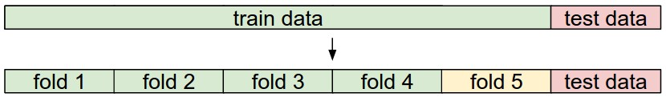

这是一个旨在向计算机视觉领域外的人介绍图像分类问题和数据驱动方法的入门介绍。目录如右侧所示：

## 图像分类

**动机**。在本节中，我们将介绍图像分类问题，这是将输入图像分配给固定类别集合中的一个标签的任务。尽管这个问题很简单，但它是计算机视觉中的核心问题之一，具有许多实际应用。此外，正如我们将在课程后面看到的，许多其他看似不同的计算机视觉任务（如目标检测、分割）都可以归结为图像分类。

**示例**。例如，在下面的图像中，图像分类模型接受一个图像并为4个标签（*{猫、狗、帽子、杯子}*）分配概率。如图所示，请记住，对于计算机而言，图像被表示为一个大的三维数字数组。在这个示例中，猫的图像宽度为248像素，高度为400像素，并具有三个颜色通道：红色、绿色、蓝色（简称RGB）。因此，图像由248 x 400 x 3个数字组成，总共297,600个数字。每个数字都是一个从0（黑色）到255（白色）的整数。我们的任务是将这25万个数字转化为一个单一的标签，比如*"猫"*。

 

>在图像分类任务中，我们的目标是为给定的图像预测一个单一标签（或如此处所示，预测标签的分布，以表示我们的置信度）。图像是由整数构成的三维数组，取值范围从0到255，大小为宽度 x 高度 x 3。这里的3代表了三个颜色通道：红色、绿色、蓝色。

**挑战**。由于对于人类来说，识别视觉概念（例如猫）相对容易，因此值得从计算机视觉算法的角度考虑所涉及的挑战。在下面我们列举了（不全面的）一些挑战时，请记住图像的原始表示是一个由亮度值组成的三维数组：

- **视角变化**。同一对象的单个实例可以以许多不同的方式相对于相机定位。
- **尺度变化**。视觉类别通常在大小上表现出变化（指的是实际世界中的大小，而不仅仅是图像中的大小）。
- **形变**。许多感兴趣的对象不是刚体，可以以极端方式变形。
- **遮挡**。感兴趣的对象可能会被遮挡。有时候，只有对象的一小部分（可能只有几个像素）可见。
- **光照条件**。光照对像素级别产生显著影响。
- **背景杂乱**。感兴趣的对象可能会与其环境融为一体，难以识别。
- **类内变异**。感兴趣的类别通常相对广泛，例如*椅子*。这些对象有许多不同的类型，每种类型都有自己的外观。

一个好的图像分类模型必须对所有这些变化的交叉乘积cross product保持不变，同时保留对类间变化的敏感性。

 

**数据驱动方法**。我们如何编写一个能够将图像分类到不同类别的算法呢？与编写用于对一列数字进行排序的算法不同，很难想象如何编写一个用于识别图像中的猫的算法。因此，与其试图直接在代码中指定感兴趣的每个类别的外观，我们采取的方法与您对待孩子的方法类似：我们将为计算机提供每个类别的许多示例，然后开发学习算法，这些算法会查看这些示例并学习每个类别的视觉外观。这种方法被称为*数据驱动方法*，因为它首先依赖于积累带有标签的图像的*训练数据集*。以下是这样一个数据集的示例：


> 这是一个包含四个视觉类别的示例训练集。在实际应用中，我们可能有数千个类别，每个类别都有数十万张图像。

**图像分类流程**。我们已经看到，在图像分类中的任务是将表示单个图像的像素数组分配一个标签。我们的完整流程可以正式表述如下：

- **输入**：我们的输入包括一组*N*张图像，每张图像都带有*K*个不同类别中的一个标签。我们将这些数据称为*训练集*。
- **学习**：我们的任务是使用训练集来学习每个类别的外观。我们将这一步称为*训练分类器*或*学习模型*。
- **评估**：最后，我们通过要求分类器为它以前从未见过的一组新图像预测标签来评估分类器的质量。然后，我们将这些图像的真实标签与分类器预测的标签进行比较。直观地说，我们希望很多预测与真实答案（我们称之为*真值ground truth*）相匹配。

<a name='nn'></a>

### 最近邻分类器 Nearest Neighbor Classifier

作为我们的第一种方法，我们将开发一种称为**最近邻分类器**的方法。这个分类器与卷积神经网络无关，在实践中很少使用，但它将让我们了解图像分类问题的基本方法。

**示例图像分类数据集：CIFAR-10**。一个流行的玩具toy图像分类数据集是[CIFAR-10数据集](https://www.cs.toronto.edu/~kriz/cifar.html)。该数据集包含60,000张尺寸为32x32像素的小图像。每个图像都带有10个类别中的一个标签（例如*"飞机、汽车、鸟类等"*）。这60,000张图像分为50,000张训练集和10,000张测试集。在下面的图像中，您可以看到来自每个10个类别中的10个随机示例图像：

 

> 左图：[CIFAR-10数据集](https://www.cs.toronto.edu/~kriz/cifar.html)的示例图像。右图：第一列显示了一些测试图像，旁边的每个图像都显示了根据像素差异而确定的训练集中的前10个最近邻图像。

现在假设我们有CIFAR-10的训练集，其中包含50,000张图像（每个标签有5,000张图像），我们希望对剩余的10,000张进行标记。最近邻分类器将获取一个测试图像，将其与训练集中的每一张图像进行比较，并预测与最接近的训练图像相同的标签。在上面的图像右侧，您可以看到这种过程的10个示例测试图像的结果。请注意，在这10个示例中，只有约3个示例中检索到了相同类别的图像，而在其他7个示例中则不是这样。例如，在第8行，马头的最近邻训练图像是一辆红色汽车，这可能是由于强烈的黑色背景造成的。因此，在这种情况下，这张马的图像会被错误地标记为汽车。

您可能已经注意到，我们并未明确说明我们如何精确比较两张图像的细节，而在这种情况下，这只是两个32 x 32 x 3的图像块。其中一个最简单的可能性是逐像素比较图像并累加所有差异。换句话说，给定两张图像并将它们表示为向量 $I_1$, $I_2$ ，比较它们的一个合理选择可能是**L1距离**：


$$
d_1 (I_1, I_2) = \sum_{p} \left| I^p_1 - I^p_2 \right|
$$

其中总和取自所有像素。以下是该过程的可视化过程：

 

>使用像素差异来比较两张图像的示例，使用L1距离（在此示例中为一个颜色通道）。两张图像进行逐元素相减，然后将所有差异相加得到一个单一数字。如果两张图像相同，结果将为零。但如果图像非常不同，结果将很大。

让我们也看看如何在代码中实现分类器。首先，让我们将CIFAR-10数据加载到内存中，作为4个数组：训练数据/标签和测试数据/标签。在下面的代码中，`Xtr`（大小为50,000 x 32 x 32 x 3）包含训练集中的所有图像，相应的一维数组`Ytr`（长度为50,000）包含训练标签（从0到9）：

```python
Xtr, Ytr, Xte, Yte = load_CIFAR10('data/cifar10/') # a magic function we provide
# flatten out all images to be one-dimensional
Xtr_rows = Xtr.reshape(Xtr.shape[0], 32 * 32 * 3) # Xtr_rows becomes 50000 x 3072
Xte_rows = Xte.reshape(Xte.shape[0], 32 * 32 * 3) # Xte_rows becomes 10000 x 3072
```

现在，我们已经将所有图像展开为行，下面是如何训练和评估分类器的示例代码：

```python
nn = NearestNeighbor() # create a Nearest Neighbor classifier class
nn.train(Xtr_rows, Ytr) # train the classifier on the training images and labels
Yte_predict = nn.predict(Xte_rows) # predict labels on the test images
# and now print the classification accuracy, which is the average number
# of examples that are correctly predicted (i.e. label matches)
print 'accuracy: %f' % ( np.mean(Yte_predict == Yte) )
```

请注意，作为评估标准，通常使用**准确度accuracy**，它测量了正确预测的比例。请注意，我们将构建的所有分类器都满足一个共同的API：它们都有一个`train(X,y)`函数，该函数接受数据和标签进行学习。在内部，该类应该构建一些关于标签以及如何从数据中预测它们的模型。然后还有一个`predict(X)`函数，该函数接受新数据并预测标签。当然，我们省略了事情的实质部分 - 实际的分类器本身。下面是一个使用L1距离的简单最近邻分类器的实现，它满足了这个模板：

```python
import numpy as np

class NearestNeighbor(object):
  def __init__(self):
    pass

  def train(self, X, y):
    """ X is N x D where each row is an example. Y is 1-dimension of size N """
    # the nearest neighbor classifier simply remembers all the training data
    self.Xtr = X
    self.ytr = y

  def predict(self, X):
    """ X is N x D where each row is an example we wish to predict label for """
    num_test = X.shape[0]
    # lets make sure that the output type matches the input type
    Ypred = np.zeros(num_test, dtype = self.ytr.dtype)

    # loop over all test rows
    for i in range(num_test):
      # find the nearest training image to the i'th test image
      # using the L1 distance (sum of absolute value differences)
      distances = np.sum(np.abs(self.Xtr - X[i,:]), axis = 1)
      min_index = np.argmin(distances) # get the index with smallest distance
      Ypred[i] = self.ytr[min_index] # predict the label of the nearest example

    return Ypred
```

如果运行此代码，您将看到该分类器在CIFAR-10上只能达到**38.6%**的准确率。这比随机猜测要好得多（随机猜测将提供10%的准确率，因为有10个类别），但远远不及人类表现（估计约为94%）[参考链接](https://karpathy.github.io/2011/04/27/manually-classifying-cifar10/)，也远远不及最先进的卷积神经网络，它们达到了约95%的准确率，与人类准确率相匹配（请参阅CIFAR-10的[Kaggle竞赛排行榜](https://www.kaggle.com/c/cifar-10/leaderboard)）。

**距离的选择。**计算向量之间的距离有许多其他方法。另一个常见的选择可能是使用**L2距离**，它具有计算两个向量之间的欧几里德距离的几何解释。该距离的形式如下：
$$
d_2 (I_1, I_2) = \sqrt{\sum_{p} \left( I^p_1 - I^p_2 \right)^2}
$$

换句话说，我们将像以前一样计算像素差异，但这次我们会将它们全部平方，相加，然后最后取平方根。在numpy中，使用上面的代码，我们只需要替换一行代码。即计算距离的那一行：

```python
distances = np.sqrt(np.sum(np.square(self.Xtr - X[i,:]), axis = 1))
```

请注意，我在上面包括了`np.sqrt`调用，但在实际的最近邻应用中，我们可以省略平方根操作，因为平方根是一个*单调函数*。也就是说，它会缩放距离的绝对大小，但会保留排序，因此带或不带它的最近邻是相同的。如果在CIFAR-10上使用这个距离运行最近邻分类器，您将获得**35.4%**的准确率（略低于我们的L1距离结果）。

**L1 vs. L2**。考虑这两种度量之间的差异是很有趣的。特别是，当涉及到两个向量之间的差异时，L2距离比L1距离更加严格unforgiving 。也就是说，L2距离更喜欢许多中等程度的差异medium disagreements，而不是一个大的差异。L1和L2距离（或者等效地，一对图像之间的差异的L1/L2范数）是[p-范数](https://planetmath.org/vectorpnorm)的最常用的特殊情况。

<a name='knn'></a>

### k-最近邻分类器 k - Nearest Neighbor Classifier

您可能已经注意到，当我们希望进行预测时，仅使用最近图像的标签是奇怪的。事实上，几乎总是可以通过使用所谓的**k-最近邻分类器**来获得更好的效果。这个想法非常简单：不再只找到训练集中的单一最近图像，而是找到**k**个最近图像，并让它们对测试图像的标签进行投票。特别地，当*k=1*时，我们恢复了最近邻分类器。直观地说，较高的**k**值具有平滑效果，使分类器更能抵抗异常值outliers：


> 这是最近邻和5-最近邻分类器之间的差异示例，使用二维点和三个类别（红色、蓝色、绿色）。彩色区域显示了由L2距离诱导induced的分类器产生的<b>决策边界</b>。白色区域显示了模糊分类的点（即至少有两个类别的投票相等）。请注意，在最近邻分类器的情况下，outlier异常数据点（例如，在蓝点云中间的绿点）会创建可能不正确的小岛屿预测，而5-最近邻分类器则平滑了这些不规则性irregularities，可能导致对测试数据（未显示）更好的<b>泛化</b>。还请注意，在5-最近邻图像中的灰色区域是由于在最近邻中的投票中存在平局（例如，2个最近邻是红色，接下来的两个最近邻是蓝色，最后一个最近邻是绿色）所导致的。


在实践中，您几乎总是希望使用k-最近邻。但是应该使用什么值的*k*？接下来我们将讨论这个问题。

<a name='val'></a>

### 用于超参数调整的验证集 Validation sets for Hyperparameter tuning

k-最近邻分类器需要设置*k*。但是什么数值最好？此外，我们看到有许多不同的距离函数可供选择：L1范数、L2范数，还有许多其他选择，甚至我们都没有考虑（例如点积）。这些选择被称为**超参数**，它们在许多从数据中学习的机器学习算法的设计中经常出现。通常不明显应该选择什么值/设置。

您可能会建议我们尝试许多不同的值，看看哪个效果最好。这是一个很好的想法，确实也是我们将要做的事情，但必须非常小心。特别是，**我们不能使用测试集来调整超参数**。无论何时设计机器学习算法，您都应该将测试集视为一种非常宝贵的资源，最好在最后一次之前永远不要触摸它。否则，非常现实的危险是您可能会调整超参数以在测试集上表现良好，但如果部署模型，性能可能会显著降低。在实践中，我们会说您在测试集上**过拟合overfit**。另一种看待问题的方式是，如果您在测试集上调整超参数，实际上是将测试集用作训练集，因此在部署模型时观察到的性能将与您实际观察到的性能相比太过乐观。但是，如果您只在最后一次使用测试集，它仍然是衡量分类器**泛化generalization**的良好代理proxy （我们将在课程后面看到有关泛化的更多讨论）。

> 仅在最后一次评估测试集。

幸运的是，有一种正确的方法可以调整超参数，而不需要接触测试集。思路是将我们的训练集分为两部分：稍小的训练集和我们称之为**验证集**的部分。以CIFAR-10为例，我们可以例如使用49,000张训练图像进行训练，将1,000张留作验证。这个验证集本质上是一个假的测试集，用于调整超参数。

在CIFAR-10的情况下，可能会如下所示：

```python
# assume we have Xtr_rows, Ytr, Xte_rows, Yte as before
# recall Xtr_rows is 50,000 x 3072 matrix
Xval_rows = Xtr_rows[:1000, :] # take first 1000 for validation
Yval = Ytr[:1000]
Xtr_rows = Xtr_rows[1000:, :] # keep last 49,000 for train
Ytr = Ytr[1000:]

# find hyperparameters that work best on the validation set
validation_accuracies = []
for k in [1, 3, 5, 10, 20, 50, 100]:

  # use a particular value of k and evaluation on validation data
  nn = NearestNeighbor()
  nn.train(Xtr_rows, Ytr)
  # here we assume a modified NearestNeighbor class that can take a k as input
  Yval_predict = nn.predict(Xval_rows, k = k)
  acc = np.mean(Yval_predict == Yval)
  print 'accuracy: %f' % (acc,)

  # keep track of what works on the validation set
  validation_accuracies.append((k, acc))
```

在这个过程结束时，我们可以绘制一个图表，显示哪些*k*值效果最好。然后，我们将使用这个值进行最终评估，仅在实际的测试集上运行一次并报告性能。

>将训练集分为训练集和验证集。使用验证集来调整所有超参数。最后，在测试集上运行一次并报告性能。

**交叉验证Cross-validation**
在训练数据的大小（因此也是验证数据）可能很小的情况下，人们有时会使用一种更复杂的超参数调整技术，称为**交叉验证**。以前面的示例为例，交叉验证的思想是，不是随机选择前1000个数据点作为验证集，剩下的作为训练集，而是通过迭代不同的验证集来更好地估计某个*k*值的性能，减少噪声。例如，在5折交叉验证中(5-fold cross-validation)，我们将训练数据分为5个相等的折叠fold，使用其中4个进行训练，1个进行验证。然后，我们会迭代哪个折叠是验证折叠fold，评估性能，最后在不同折叠fold之间平均性能。

 

这是一个关于参数<b>k</b>的5折交叉验证运行的示例。对于每个<b>k</b>值，我们在4个折叠上进行训练，并在第5个折叠上进行评估。因此，对于每个<b>k</b>，我们会得到5个在验证折叠上的准确性（准确性是y轴，每个结果都是一个点）。趋势线通过每个<b>k</b>的结果平均值绘制，误差条表示标准差。请注意，在这种特殊情况下，交叉验证建议在这个特定数据集上使用约<b>k</b> = 7的值效果最好（对应于图中的峰值）。如果使用了超过5个折叠，我们可能会看到一个更平滑（即更少噪声）的曲线。

**在实践中**。在实践中，人们更喜欢避免使用交叉验证，而更倾向于使用单一的验证拆分，因为交叉验证可能计算成本较高。人们通常使用的拆分方式是将50%-90%的训练数据用于训练，剩余部分用于验证。然而，这取决于多个因素：例如，如果超参数的数量很大，您可能更喜欢使用更大的验证拆分。如果验证集中的示例数量很小（可能仅有几百个），则使用交叉验证更安全。在实际应用中，常见的折叠数量可能是3折、5折或10折交叉验证。

 

>常见的数据拆分方式。给定一个训练集和一个测试集。训练集被分成若干折（例如，这里有5折）。折1-4成为训练集。一折（例如，这里的黄色折5）被称为验证折，用于调整超参数。交叉验证更进一步，迭代选择哪个折是验证折，分别从1到5。这将被称为5折交叉验证。在最后，一旦模型训练完成并确定了所有最佳超参数，模型会在测试数据上进行一次性的评估（红色）。

<a name='procon'></a>

**最近邻分类器的优缺点**

值得考虑一下最近邻分类器的一些优点和缺点。显然，一个优点是它非常简单易懂。此外，该分类器无需训练时间，因为所需的只是存储和可能索引训练数据。然而，在测试时我们要付出计算成本，因为对测试样本进行分类需要与每个训练样本进行比较。这是相反的，因为在实践中，我们通常更关心测试时的效率，而不是训练时的效率。事实上，我们将在本课程后面开发的深度神经网络将这种权衡推向了另一个极端：它们训练成本很高，但一旦训练完成，对新的测试样本进行分类非常便宜。这种操作模式在实践中更加可取。

另外，最近邻分类器的计算复杂性是一个活跃的研究领域，存在多种**近似最近邻Approximate Nearest Neighbor**（ANN）算法和库，可以加速数据集中最近邻查找（例如[FLANN](https://github.com/mariusmuja/flann)）。这些算法允许在最近邻检索的正确性与检索期间的空间/时间复杂性之间进行权衡，并通常依赖于一个涉及构建kdtree或运行k均值算法的预处理/索引阶段。

最近邻分类器在某些情况下可能是一个不错的选择（特别是如果数据维度较低），但在实际图像分类环境中很少合适。一个问题是图像是高维对象（即它们通常包含许多像素），高维空间中的距离可能非常不直观counter-intuitive。下面的图像说明了基于像素的L2相似性与感知相似性perceptual similarities之间的差异：

 

>基于像素的距离在高维数据（尤其是图像）上可能非常不直观。左侧是一个原始图像，旁边是另外三个图像，它们在基于像素的L2距离上都与原始图像等距离。显然，像素级的距离与感知perceptual或语义semantic相似性毫无关系。

这里还有一个可视化示例，旨在说服您使用像素差异来比较图像是不足够的。我们可以使用一种名为[t-SNE](https://lvdmaaten.github.io/tsne/)的可视化技术，将CIFAR-10图像嵌入到二维空间中，以便最大程度地保留它们之间的（局部）成对距离。在这个可视化中，附近显示的图像根据我们上面开发的L2像素距离被认为非常接近：

 

>使用t-SNE将CIFAR-10图像嵌入到二维空间中。在这个图像中，根据L2像素距离附近显示的图像被认为是接近的。请注意，背景比语义类别差异更具显著性。点击<a href="https://eanyang7.github.io/cs231n/courses/neural_network/classification.assets/pixels_embed_cifar10_big.jpg">这里</a>查看更大版本的可视化。

特别要注意的是，附近的图像更多地取决于图像的一般颜色分布或背景类型，而不是它们的语义身份。例如，一只狗可以被认为与一只青蛙非常接近，因为它们都碰巧在白色背景上。理想情况下，我们希望所有10个类别的图像都形成自己的聚类，这样相同类别的图像可以彼此接近，而不受不相关特征和变化（例如背景）的影响。然而，要实现这一属性，我们需要超越原始像素go beyond raw pixels。

<a name='summary'></a>

### 总结 Summary

总结一下：

- 我们介绍了**图像分类**的问题，其中我们被提供了一组带有单一类别标签的图像。然后，我们被要求为一组新的测试图像预测这些类别，并测量预测的准确性。
- 我们介绍了一个简单的分类器，称为**最近邻分类器**。我们看到这个分类器有多个与之关联的超参数（例如k的值，或用于比较示例的距离类型），并且没有明显的选择方法。
- 我们看到设置这些超参数的正确方法是将训练数据分成两部分：训练集和一个我们称之为**验证集**的伪测试集fake test se。我们尝试不同的超参数值，并保留在验证集上表现最好的值。
- 如果担心训练数据不足，我们讨论了一种称为**交叉验证**的过程，它可以帮助减少 估计哪些超参数最有效的 噪声。
- 一旦找到最佳超参数，我们固定它们，并在实际的测试集上执行单一的**评估**。
- 我们看到最近邻方法在CIFAR-10上可以达到大约40%的准确性。它简单易实现，但要求我们存储整个训练集，而且在测试图像上评估的代价很高。
- 最后，我们看到使用L1或L2距离来衡量原始像素值是不足够的，因为这些距离与图像的背景和颜色分布的相关性更强，而与它们的语义内容相关性较弱。

在接下来的课程中，我们将着手解决这些挑战，最终找到可以达到90%准确性的解决方案，允许我们在学习完成后完全丢弃训练集，并且允许我们在不到一毫秒的时间内评估测试图像。

<a name='summaryapply'></a>

### 总结：在实践中应用kNN

如果你希望在实践中应用kNN（希望不是在图像上，或者仅作为一个基准baseline），请按照以下步骤进行：

1. 预处理数据：将数据中的特征（例如图像中的一个像素）标准化，使其具有零均值和单位方差。我们将在后面的部分中更详细地介绍这一点，并选择不在本节中讨论数据标准化，因为图像中的像素通常是均匀的，不具有广泛不同的分布，从而减轻了数据标准化的需要。
2. 如果你的数据是高维的，请考虑使用降维技术，如PCA（主成分分析[wiki ref](https://en.wikipedia.org/wiki/Principal_component_analysis), [CS229ref](http://cs229.stanford.edu/notes/cs229-notes10.pdf), [blog ref](https://web.archive.org/web/20150503165118/http://www.bigdataexaminer.com:80/understanding-dimensionality-reduction-principal-component-analysis-and-singular-value-decomposition/)），NCA（邻域成分分析[wiki ref](https://en.wikipedia.org/wiki/Neighbourhood_components_analysis), [blog ref](https://kevinzakka.github.io/2020/02/10/nca/)）或甚至[随机投影Random Projections](https://scikit-learn.org/stable/modules/random_projection.html)。
3. 随机将训练数据拆分成训练/验证集。通常情况下，约70-90%的数据通常分配给训练集。这个设置取决于你有多少超参数以及你希望它们具有多大的影响。**如果需要估计许多超参数，应该更倾向于具有较大验证集，以有效地估计它们**。如果你担心验证数据的大小，最好将训练数据拆分为多个折叠并执行交叉验证。如果你有计算预算，最好始终使用交叉验证（折叠越多越好，但也越昂贵）。
4. 为多个**k**值（越多越好）以及不同的距离类型（L1和L2是不错的选择）在验证数据上训练和评估kNN分类器。
5. 如果你的kNN分类器运行时间太长，可以考虑使用近似最近邻库（例如[FLANN](https://github.com/mariusmuja/flann)）来加速检索（以一些准确性为代价）。
6. 注意记录给出最佳结果的超参数。关于是否应该使用最佳超参数的完整训练集存在一个问题，因为如果将验证数据合并到训练集中，最佳超参数可能会发生变化（因为数据的大小会更大）。实际上，最好不在最终分类器中使用验证数据，并将其视为估计超参数的*耗尽burned* 。在测试集上评估最佳模型。报告测试集的准确性，并宣布这个结果是kNN分类器在你的数据上的性能。

<a name='reading'></a>

#### 进一步阅读

以下是一些（可选的）链接，你可能会对进一步阅读感兴趣：

- [有关机器学习的一些有用信息](https://homes.cs.washington.edu/~pedrod/papers/cacm12.pdf)，特别是第6节相关，但整篇论文都强烈推荐阅读。

- [识别和学习物体类别](https://people.csail.mit.edu/torralba/shortCourseRLOC/index.html)，这是2005年ICCV的一个关于物体分类的短期课程。
