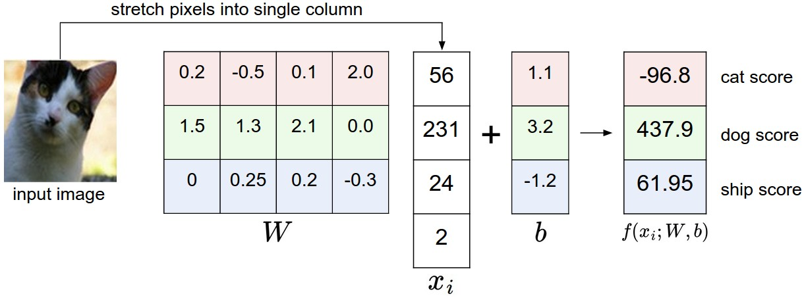

## 线性分类

在上一节中，我们介绍了图像分类的问题，这是从固定类别集中为图像分配单一标签的任务。此外，我们描述了k-最近邻（kNN）分类器，该分类器通过将图像与训练集中的（带注释的）图像进行比较来为它们贴上标签。如我们所见，kNN有很多缺点：

- 分类器必须*记住*所有的训练数据，并将其存储以供将来与测试数据进行比较。这在空间上是低效的，因为数据集的大小可能轻松达到数十个G。
- 对测试图像进行分类是昂贵的，因为它需要与所有训练图像进行比较。

**概述**。我们现在将开发一个更强大的图像分类方法，我们最终将自然地扩展到整个神经网络和卷积神经网络。该方法将有两个主要组成部分：一个**评分函数score function**，将原始数据映射到类别分数，和一个**损失函数loss function**，量化预测分数与真值标签之间的一致性agreement。然后，我们将此问题转化为优化问题，在该问题中，我们将最小化损失函数相对于评分函数的参数。

### 参数化的图像到标签分数的映射

此方法的第一个组成部分是定义评分函数score function，该函数将图像的像素值映射到每个类的置信度评分confidence scores。我们将通过一个具体示例来展示这种方法。与之前一样，假设有一个训练数据集的图像 $x_i \in R^D$，每个图像都与一个标签 $y_i$ 相关。这里 $i = 1 \dots N$ 且 $y_i \in 1 \dots K$。也就是说，我们有 **N** 个样本（每个的维度为 **D**）和 **K** 个不同的类别。例如，在 CIFAR-10 中，我们有 **N** = 50,000 的训练图像，每个图像有 **D** = 32 x 32 x 3 = 3072 个像素，和 **K** = 10，因为有10个不同的类别（如狗、猫、汽车等）。我们现在将定义评分函数 $f: R^D \mapsto R^K$，该函数将原始图像像素映射到类评分class scores。

**线性分类器。** 在这个模块中，我们将从可能是最简单的函数开始，一个线性映射：


$$
f(x_i, W, b) =  W x_i + b
$$

在上述等式中，我们假设图像 $x_i$ 的所有像素都展平成一个形状为 [D x 1] 的单列向量。矩阵 **W**（大小为 [K x D]），和向量 **b**（大小为 [K x 1]）是这个函数的**参数parameters**。在 CIFAR-10 中，$x_i$ 包含第 i 张图像中所有展平成一个单独的 [3072 x 1] 列的像素，**W** 是 [10 x 3072]，**b** 是 [10 x 1]，因此3072个数字输入函数（原始像素值），并输出10个数字（类得分）。在 **W** 中的参数通常被称为**权重weights**，而 **b** 被称为**偏置向量bias vector**，因为它会影响输出得分，但不与实际数据 $x_i$ 交互。但你经常会听到人们交替使用*权重*和*参数*这两个术语。

需要注意的几点：

- 首先，注意单个矩阵乘法 $W x_i$ 实际上是**并行评估**10个单独的分类器（每个类一个），其中每个分类器是 **W** 的一行。
- 请注意，我们认为输入数据 $(x_i, y_i)$ 是给定和固定的，但我们可以控制参数 **W,b** 的设置。我们的目标是以这样的方式设置它们，使得计算出的得分在整个训练集中与真值标签匹配。我们将详细讨论如何做到这一点，但直观地说，我们希望正确的类别有一个得分，这个得分高于不正确类别的得分。
- 这种方法的一个优点是，训练数据用于学习参数 **W,b**，但一旦学习完成，我们可以丢弃整个训练集，只保留学到的参数。这是因为新的测试图像可以简单地通过该函数进行转发forward，并根据计算得分进行分类。
- 最后，请注意，对测试图像进行分类涉及单个矩阵乘法和加法，这比将测试图像与所有训练图像进行比较要快得多。

> 伏笔foreshadowing:卷积神经网络将会像上面所展示的那样将图像像素映射到分数，但映射（f）将会更加复杂且包含更多的参数。

### 解释线性分类器

注意，线性分类器计算一个类的得分是通过其所有3个颜色通道上的所有像素值的加权和来完成的。根据我们为这些权重设定的具体值，该函数有能力喜欢或不喜欢（取决于每个权重的符号）图像中某个位置的某种颜色。例如，你可以想象如果一张图像的两侧有很多蓝色（这可能对应于水），那么“船”类可能更有可能被分类。那么，你可能会期望“船”分类器在其蓝色通道权重上有很多正权重（蓝色的存在增加了船的得分），而在红色/绿色通道上有负权重（红色/绿色的存在降低了船的得分）。

 

>一个将图像映射到类得分的例子。为了可视化，我们假设图像只有4个像素（4个单色像素，为简洁起见，我们在此示例中没有考虑颜色通道），并且我们有3个类（红色（猫）、绿色（狗）、蓝色（船）类）。（澄清：特别是，这里的颜色仅表示3个类，与RGB通道无关。）我们将图像像素拉伸成一列并进行矩阵乘法以获得每个类的得分。注意，这一特定的权重集W一点也不好：权重给我们的猫图像分配了一个非常低的猫得分。具体来说，这组权重似乎确信它看到的是一只狗。

**将图像视为高维点high-dimensional points的类比analogy。** 由于图像被展开成高维列向量，我们可以将每个图像解释为这个空间中的一个点（例如，CIFAR-10中的每个图像是32x32x3像素的3072维空间中的一个点）。类似地，整个数据集是一组（带标签的）点。

由于我们定义了每个类的得分为所有图像像素的加权和，每个类的得分都是在这个空间上的**线性函数**。我们不能可视化3072维的空间，但如果我们想象将所有这些维度压缩到仅两个维度中，那么我们可以尝试可视化分类器可能在做什么：

 

>在图像空间的卡通表示中，每个图像是一个单点，三个分类器被可视化。使用汽车分类器（红色）为例，红线显示了在空间中所有得到汽车类得分为零的点。红色箭头显示了增加的方向，所以红线右侧的所有点都有正的（并且线性增加）得分，而左侧的所有点都有负的（并且线性减少）得分。

如上所述，$W$ 的每一行都是其中一个类的分类器。这些数字的几何解释是，当我们改变 $W$ 的其中一行时，像素空间中的相应线条会朝不同的方向旋转。另一方面，偏置 $b$ 允许我们的分类器平移这些线。特别地，注意没有偏置项，插入 $x_i = 0$ 总是会得到得分为零，不管权重如何，所有的线都会被迫穿过原点。

**将线性分类器解释为模板匹配template matching**：权重 $W$ 的另一个解释是 $W$ 的每一行对应于其中一个类的*模板*（或有时也被称为*原型prototype*）。然后，通过使用*内积inner product*（或*点积dot product*）将每个模板与图像一一比较来获得图像的每个类的得分，以找到最合适的模板。使用这个术语，线性分类器正在进行模板匹配，其中模板是学习得到的。另一种思考方式是，我们实际上仍然有效地进行最近邻匹配，但与有成千上万的训练图像不同，我们每个类只使用一个图像（尽管我们会学习它，并且它不一定是训练集中的一个图像），我们使用（负）内积作为距离，而不是L1或L2距离。

 

>CIFAR-10学习结束时的示例学习权重。请注意，例如，船的模板包含了许多蓝色像素，正如预期的那样。因此，一旦与海上船只的图像进行内积匹配，这个模板将会获得高分。

另外需要注意的是，马的模板似乎包含了一匹双头马，这是由于数据集中存在左右朝向的马。线性分类器将这两种马的模式*合并*成一个单一的模板。类似地，汽车分类器似乎已将多种模式合并为一个单一的模板，该模板必须识别各种角度和颜色的汽车。特别是，这个模板最终是红色的，这暗示了CIFAR-10数据集中红色汽车比其他颜色的汽车更多。线性分类器太弱了，不能正确处理不同颜色的汽车，但正如我们后面将看到的，神经网络将允许我们执行这个任务。稍微展望一下，神经网络将能够在其隐藏层中发展中间神经元，这些神经元可以检测特定类型的汽车（例如，朝左的绿色汽车、正面的蓝色汽车等），下一层的神经元可以**通过各个汽车检测器的加权求和来组合这些神经元，从而得到更准确的汽车评分**。

**偏置Bias技巧。** 在继续之前，我们想提到一种常见的简化技巧，将两个参数$W$和$b$表示为一个参数。回顾一下，我们定义了得分函数如下：


$$
f(x_i, W, b) =  W x_i + b
$$

随着我们继续学习，单独跟踪两组参数（偏置$b$和权重$W$）有点繁琐。一个常用的技巧是将这两组参数合并为一个单独的矩阵，通过在向量$x_i$中添加一个额外的维度，始终保持常数$1$ ——一个默认的*偏置维度bias dimension*。有了额外的维度，新的得分函数将简化为单一的矩阵乘法：


$$
f(x_i, W) =  W x_i
$$

在我们的CIFAR-10示例中，$x_i$现在是[3073 x 1]而不是[3072 x 1] ——（额外的维度包含常数1），$W$现在是[10 x 3073]而不是[10 x 3072]。现在的$W$矩阵的额外列对应于偏差$b$。以下是一个图可能有助于解释：


> 偏置技巧的示意图。进行矩阵乘法然后添加偏置向量（左侧）等效于向所有输入向量添加一个常数为1的偏置维度，并扩展权重矩阵为1列 —— 一个偏置列（右侧）。因此，如果我们通过将所有向量附加到1来预处理我们的数据，那么我们只需要学习一个权重矩阵，而不是包含权重和偏置的两个矩阵。

**图像数据预处理。** 作为一个快速说明，在上面的示例中，我们使用了原始像素值（范围从[0...255]）。在机器学习中，一种非常常见的做法是始终对输入特征进行标准化处理（在图像的情况下，**每个像素被视为一个特征**）。特别地，重要的是通过减去每个特征的均值来**居中数据**。对于图像来说，这相当于计算训练图像中的*均值图像*，并从每个图像中减去它，以获得像素范围大约为[-127...127]的图像。更常见的预处理是对每个输入特征进行**缩放**，使其值范围在[-1, 1]之间。其中，零均值中心化可能更重要，但在我们理解梯度下降的动态（dynamics of gradient descent）之前，我们需要等待对它的正当理由（justification ）。

### 损失函数

在前一节中，我们定义了从像素值到类别分数的函数，其参数化为一组权重$W$。此外，我们看到我们对数据$(x_i, y_i)$没有控制权（它是固定的且已给定），但我们对这些权重有控制权，并且我们希望设置它们以使预测的类别分数与训练数据中的真实标签一致。

例如，回到猫的示例图像及其类别“猫”、“狗”和“船”的分数，我们看到该示例中的权重集合实际上不太好：我们输入了描述猫的像素，但猫的分数非常低（-96.8），而与其他类别相比（狗分数437.9和船分数61.95），分数很低。我们将用一个**损失函数loss function**（有时也称为**成本函数cost function**或**目标函数objective**）来衡量我们对这种结果的不满（unhappiness）。直观地说，如果我们在分类训练数据方面表现不佳，损失将很高，如果表现良好，损失将很低。

#### 多类支持向量机损失

有多种方式来定义损失函数的详细细节。作为第一个示例，我们将首先介绍一种常用的损失函数，称为**多类支持向量机Multiclass Support Vector Machine**（SVM）损失。SVM损失的设置是，SVM“希望”每个图像的正确类别具有比一些固定间隔fixed margin$\Delta$更高的分数。请注意，有时将损失函数拟人化是有帮助的，就像我们之前所做的那样：SVM“希望”某种结果，因为该结果将产生较低的损失（这是好事）。

现在让我们更加精确。回想一下，对于第i个示例，我们被给出图像$x_i$的像素和指定正确类别的标签$y_i$，该标签指定正确类别的索引。得分函数获取像素并计算类别分数向量$f(x_i, W)$，我们将其缩写为$s$（表示分数）。例如，第j个类别的分数是j个元素：$s_j = f(x_i, W)_j$。第i个示例的多类SVM损失如下形式化：


$$
L_i = \sum_{j\neq y_i} \max(0, s_j - s_{y_i} + \Delta)
$$

**示例：** 让我们通过一个示例来解释这个损失函数的工作原理。假设我们有三个类别，它们接收到分数$s = [13, -7, 11]$，并且第一个类别是真实类别（即$y_i = 0$）。还假设$\Delta$（稍后我们将详细讨论的超参数）为10。上面的表达式对所有不正确的类别（$j \neq y_i$）求和，因此我们得到两项：


$$
L_i = \max(0, -7 - 13 + 10) + \max(0, 11 - 13 + 10)
$$

您可以看到第一项为零，因为[-7 - 13 + 10]得到一个负数，然后使用$max(0,-)$函数将其阈值化为零。我们对这一对的损失为零，因为正确类别的分数（13）比不正确类别的分数（-7）高出至少10。实际上，差距为20，远远大于10，但SVM只关心差距至少为10；任何超过间隔margin的额外差距都会被$max$操作截断为零。第二项计算的是[11 - 13 + 10]，它等于8。也就是说，尽管正确类别的分数（13 > 11）高于不正确类别的分数，但它没有达到所需的间隔10。差距只有2，这就是损失为8的原因（即满足间隔所需的差距更大）。总之，SVM损失函数希望正确类别$y_i$的分数比不正确类别的分数至少高出$\Delta$（delta）的分数。如果情况不是这样，我们将累积损失。

请注意，在本模块中，我们使用线性分数函数（$f(x_i; W) =  W x_i$ ），因此我们还可以将损失函数以以下等效形式重新编写：


$$
L_i =

 \sum_{j\neq y_i} \max(0, w_j^T x_i - w_{y_i}^T x_i + \Delta)
$$

其中$w_j$是将$W$重新整形为列后的第j行。然而，一旦我们开始考虑更复杂形式的分数函数$f$，情况就不一定如此。

在完成本节之前，我们要提到的最后一个术语是零阈值hreshold at zero $max(0,-)$函数通常称为**合页损失**（hinge loss）。有时候你会听到人们使用平方合页损失SVM（或L2-SVM），它使用形式$max(0,-)^2$，更强烈地惩罚penalize违反间隔的情况（二次而不是线性）。未平方版本更标准，但在某些数据集中，平方合页损失可能效果更好。这可以通过交叉验证确定。

> 损失函数量化了我们对训练集上预测结果的不满意程度。

 

><font color="red">多类支持向量机（Multiclass Support Vector Machine）希望正确类别的分数至少要比所有其他类别的分数高出一个间隔margin（delta）</font>。如果任何类别的分数在红色区域内（或更高），那么将累积损失。否则，损失将为零。我们的目标是找到权重，使其同时满足训练数据中所有示例的这一约束，并且使总损失尽可能低。

 **正则化**。上面我们提出的损失函数存在一个问题。假设我们有一个数据集和一组参数**W**，可以正确分类每个示例（即，所有分数都满足所有间隔条件，对于所有i都有$L_i = 0$）。问题在于，这组**W**不一定是唯一的：可能存在许多类似的**W**，可以正确分类示例。一个简单的例子是，如果一些参数**W**可以正确分类所有示例（每个示例的损失都为零），那么任何这些参数的倍数$ \lambda W $（其中$ \lambda > 1 $）也会导致零损失，因为这种变换会均匀拉伸所有分数的大小，因此也会拉伸它们的绝对差异。例如，如果正确类别和最近的不正确类别之间的分数差为15，那么将**W**的所有元素乘以2将使新的差值变为30。

换句话说，我们希望对某一组权重$W$的某些偏好进行编码，以消除这种模糊性。我们可以通过将损失函数扩展为**正则化惩罚项regularization penalty**$R(W)$来实现。最常见的正则化惩罚是平方$L2$范数，它通过对所有参数的元素二次惩罚来阻止大的权重：


$$
R(W) = \sum_k\sum_l W_{k,l}^2
$$

在上面的表达式中，我们对**W**的所有平方元素求和。请注意，正则化函数不是数据的函数，它仅基于权重。包括正则化惩罚完成完整的多类支持向量机损失，它由两个组成部分组成：**数据损失**（即所有示例的平均损失$L_i$）和**正则化损失**。因此，完整的多类SVM损失变为：


$$
L =  \underbrace{ \frac{1}{N} \sum_i L_i }_\text{数据损失} + \underbrace{ \lambda R(W) }_\text{正则化损失} \\\\
$$

或者展开为其完整形式：


$$
  L = \frac{1}{N} \sum_i \sum_{j\neq y_i} \left[ \max(0, f(x_i; W)_j - f(x_i; W)_{y_i} + \Delta) \right] + \lambda \sum_k\sum_l W_{k,l}^2
$$

其中$N$是训练示例的数量。正如您所看到的，我们将正则化惩罚附加到损失目标中，由超参数$\lambda$加权。没有简单的方法来设置这个超参数，通常通过交叉验证确定。

除了我们上面提到的动机之外，包括正则化惩罚还有许多令人满意的性质，我们将在后面的章节中回到其中的许多性质。例如，包括L2惩罚会导致SVM具有吸引人的**最大间隔max margin**属性（如果您感兴趣，可以查看[CS229](http://cs229.stanford.edu/notes/cs229-notes3.pdf)讲义中的详细信息）。

最吸引人的属性之一是，对大权重进行惩罚通常有助于提高泛化性能，因为这意味着没有输入维度可以单独对分数产生非常大的影响。例如，假设我们有一些输入向量$x = [1,1,1,1] $和两个权重向量$w_1 = [1,0,0,0]$，$w_2 = [0.25,0.25,0.25,0.25]$。然后$w_1^Tx = w_2^Tx = 1$，所以这两个权重向量都导致相同的点积，但$w_1$的L2惩罚是1.0，而$w_2$的L2惩罚仅为0.5。因此，根据L2惩罚，权重向量$w_2$将更受欢迎，因为它实现了更低的正则化损失。直观地说，这是因为$w_2$中的权重更小、更分散。由于**L2惩罚更喜欢较小和更分散的权重向量**，所以最终分类器被鼓励考虑所有输入维度的小量，而不是少量输入维度和非常强烈的输入维度。正如我们将在本课程后面看到的，这种效应可以提高分类器在测试图像上的泛化性能，并减少*过拟合overfitting*。

请注意，偏置没有相同的效果，因为与权重不同，它们不控制输入维度的影响力。因此，通常只对权重$W$进行正则化，而不对偏置$b$进行正则化。然而，在实践中，这通常对结果影响不大。最后，请注意，由于正则化惩罚，我们永远无法在所有示例上实现完全为零的损失，因为这只在$W = 0$的病态pathological设置下可能发生。

**代码**:以下是在Python中实现的损失函数（不包括正则化），分别以非向量化和半向量化形式：

```python
def L_i(x, y, W):
  """
  unvectorized version. Compute the multiclass svm loss for a single example (x,y)
  - x is a column vector representing an image (e.g. 3073 x 1 in CIFAR-10)
    with an appended bias dimension in the 3073-rd position (i.e. bias trick)
  - y is an integer giving index of correct class (e.g. between 0 and 9 in CIFAR-10)
  - W is the weight matrix (e.g. 10 x 3073 in CIFAR-10)
  """
  delta = 1.0 # see notes about delta later in this section
  scores = W.dot(x) # scores becomes of size 10 x 1, the scores for each class
  correct_class_score = scores[y]
  D = W.shape[0] # number of classes, e.g. 10
  loss_i = 0.0
  for j in range(D): # iterate over all wrong classes
    if j == y:
      # skip for the true class to only loop over incorrect classes
      continue
    # accumulate loss for the i-th example
    loss_i += max(0, scores[j] - correct_class_score + delta)
  return loss_i

def L_i_vectorized(x, y, W):
  """
  A faster half-vectorized implementation. half-vectorized
  refers to the fact that for a single example the implementation contains
  no for loops, but there is still one loop over the examples (outside this function)
  """
  delta = 1.0
  scores = W.dot(x)
  # compute the margins for all classes in one vector operation
  margins = np.maximum(0, scores - scores[y] + delta)
  # on y-th position scores[y] - scores[y] canceled and gave delta. We want
  # to ignore the y-th position and only consider margin on max wrong class
  margins[y] = 0
  loss_i = np.sum(margins)
  return loss_i

def L(X, y, W):
  """
  fully-vectorized implementation :
  - X holds all the training examples as columns (e.g. 3073 x 50,000 in CIFAR-10)
  - y is array of integers specifying correct class (e.g. 50,000-D array)
  - W are weights (e.g. 10 x 3073)
  """
  # evaluate loss over all examples in X without using any for loops
  # left as exercise to reader in the assignment
```

本节的要点是，支持向量机（SVM）损失采用一种特定的方法来衡量训练数据上的预测与实际标签的一致性。此外，对训练集进行良好的预测等同于最小化损失。

> 现在我们只需要想办法找到能最小化损失的权重即可。

### 实际考虑因素

**设置Delta。**请注意，我们忽略了超参数$\Delta$及其设置。它应该设置为什么值，是否需要进行交叉验证？事实证明，这个超参数可以在所有情况下安全地设置为$\Delta = 1.0$。超参数$\Delta$和$\lambda$似乎是两个不同的超参数，但实际上它们都控制相同的权衡：目标中数据损失和正则化损失之间的权衡tradeoff。理解这一点的关键在于权重$W$的大小直接影响分数（因此也影响它们的差异）：当我们缩小$W$内的所有值时，分数差异将变小，当我们扩大权重时，所有分数差异都将变大。因此，分数之间的确切差值（例如，$\Delta = 1$或$\Delta = 100$）在某种意义上是没有意义的，因为权重可以任意缩小或拉伸差异。因此，唯一的真正权衡是我们允许权重增长到多大程度（通过**正则化强度**$\lambda$）。

**与二元支持向量机的关系。**您可能已经有了使用二元支持向量机（Binary Support Vector Machines）的先验经验，在这种情况下，第i个示例的损失可以写成：


$$
L_i = C \max(0, 1 - y_i w^Tx_i) + R(W)
$$

其中$C$是一个超参数，$y_i \in \{ -1,1 \}$。您可以自己验证，在只有两个类别的情况下，我们在本节中呈现的公式是二元SVM的一个特殊情况。也就是说，如果我们只有两个类别，那么损失将减少到上面显示的二元SVM中。此外，这个公式中的$C$和我们公式中的$\lambda$控制相同的权衡，并且通过倒数关系$C \propto \frac{1}{\lambda}$相关联。

**旁注：原始问题中的优化。**如果您已经具备SVM的先前知识，可能也听说过核函数、对偶问题、SMO算法等。在本课程中（与神经网络一般情况一样），我们将始终使用它们在未约束的原始形式中的优化目标。许多这些目标在技术上不是可微的（例如，max(x,y)函数不可微，因为当x=y时有一个*拐点kink*），但在实际应用中，这不是问题，通常使用次梯度（subgradient）。

**旁注：其他多类SVM形式。**值得注意的是，本节介绍的多类SVM是多类问题中制定SVM的几种方法之一。另一种常用的形式是“一对多”（One-Vs-All，OVA）SVM，它为每个类别与所有其他类别训练一个独立的二元SVM。相关的但在实践中不太常见的还有“全对全”（All-vs-All，AVA）策略。我们的公式遵循了[Weston和Watkins 1999（pdf）](https://www.elen.ucl.ac.be/Proceedings/esann/esannpdf/es1999-461.pdf)的版本，这是比OVA更强大的版本（在某种意义上，您可以构建多类数据集，其中这个版本可以实现零数据损失，但OVA不能。如果感兴趣，可以查看论文中的详细信息）。您可能会看到的最后一个公式是**结构化Structured SVM*，它最大化了正确类别的分数与最高得分的不正确的亚军runner-up类别之间的差距。了解这些公式之间的差异超出了课程范围。这些笔记中呈现的版本在实践中是一个安全的选择，但可以说最简单的OVA策略可能同样有效（如Rikin等人在[捍卫一对多分类（pdf）](http://www.jmlr.org/papers/volume5/rifkin04a/rifkin04a.pdf)中所讨论的）。

### Softmax分类器

事实证明，支持向量机（SVM）是两种常见分类器中的一种。另一种常见选择是**Softmax分类器**，它具有不同的损失函数。如果您之前听说过二元Logistic回归分类器，那么Softmax分类器是它对多类问题的泛化。与SVM不同，SVM将输出$f(x_i,W)$视为每个类别的（未校准且可能难以解释）分数，Softmax分类器提供了稍微直观一些的输出（归一化的类别概率），并且还具有我们将在稍后描述的概率解释。在Softmax分类器中，函数映射$f(x_i; W) =  W x_i$保持不变，但现在我们将这些分数解释为每个类别的未归一化对数概率，并用具有以下形式的**交叉熵损失cross-entropy loss**替换了*合页损失*：


$$
L_i = -\log\left(\frac{e^{f_{y_i}}}{ \sum_j e^{f_j} }\right) \hspace{0.5in} \text{或等价地} \hspace{0.5in} L_i = -f_{y_i} + \log\sum_j e^{f_j}
$$

其中，我们使用符号$f_j$来表示类别分数向量$f$的第j个元素。与以前一样，数据集的完整损失是所有训练示例中$L_i$的平均值，再加上正则化项$R(W)$。函数$f_j(z) = \frac{e^{z_j}}{\sum_k e^{z_k}}$被称为**softmax函数**：它接受具有任意实数分数（在$z$中）的向量，并将其压缩到介于零和一之间的值的向量，使它们总和为一。涉及softmax函数的完整交叉熵损失可能在您第一次看到时看起来令人生畏，但它相对容易解释。

**信息论视角**：在“真实”分布$p$和估计的分布$q$之间的*交叉熵*被定义为：


$$
H(p,q) = - \sum_x p(x) \log q(x)
$$

因此，Softmax分类器最小化了估计的类别概率（如上面所示的$q = e^{f_{y_i}}  / \sum_j e^{f_j} $）与“真实”分布之间的交叉熵。在这种解释中，真实分布是所有概率质量mass都在正确类别上的分布（即$p = [0, \ldots 1, \ldots, 0]$在$y_i$处包含一个1）。此外，由于交叉熵可以写成熵和Kullback-Leibler散度的形式$H(p,q) = H(p) + D_{KL}(p||q)$，并且delta函数$p$的熵为零，这也等效于最小化两个分布之间的KL散度（距离度量）。换句话说，交叉熵目标*希望*预测的分布将其所有概率质量放在正确答案上。

**概率解释**：从表达式中我们可以看到


$$
  P(y_i \mid x_i; W) = \frac{e^{f_{y_i}}}{\sum_j e^{f_j} }
$$

可以解释为给定图像$x_i$和由$W$参数化的$y_i$的正确标签的（归一化）概率。从这个角度来看，Softmax分类器将输出向量$f$中的分数解释为未归一化对数概率。因此，对数化这些数量会给出（未归一化的）概率，而除法则执行归一化，以使概率总和为一。在概率解释中，我们因此最小化了正确类别的负对数似然，这可以解释为执行*最大似然估计Maximum Likelihood Estimation*（MLE）。这个观点的一个好处是，现在我们也可以将完整损失函数中的正则化项$R(W)$解释为来自于权重矩阵$W$上的高斯先验Gaussian prior，其中我们不再执行MLE，而是执行*最大后验概率Maximum a posteriori*（MAP）估计。我们提到这些解释以帮助您理解，但完整的推导细节超出了本课程的范围。

**实际问题：数值稳定性**。在实际编写计算Softmax函数的代码时，由于指数的存在，中间项$e^{f_{y_i}}$和$\sum_j e^{f_j}$可能非常大。由于大数相除可能导致数值不稳定，因此使用归一化技巧非常重要。请注意，如果我们将分数的分子和分母都乘以一个常数$C$并将其纳入总和中，我们将得到以下（在数学上等价的）表达式：


$$
  \frac{e^{f_{y_i}}}{\sum_j e^{f_j}}
  = \frac{Ce^{f_{y_i}}}{C\sum_j e^{f_j}}
  = \frac{e^{f_{y_i} + \log C}}{\sum_j e^{f_j + \log C}}
$$

我们可以自由选择$C$的值。这不会改变任何结果，但我们可以使用这个值来提高计算的数值稳定性。常见的选择是设置$\log C = -\max_j f_j$。这简单地表示我们应该将向量$f$中的值进行平移，使最大值为零。在代码中表现为：

```python
f = np.array([123, 456, 789]) # example with 3 classes and each having large scores
p = np.exp(f) / np.sum(np.exp(f)) # Bad: Numeric problem, potential blowup

# instead: first shift the values of f so that the highest number is 0:
f -= np.max(f) # f becomes [-666, -333, 0]
p = np.exp(f) / np.sum(np.exp(f)) # safe to do, gives the correct answer

```

**可能会引起混淆的命名约定**。确切地说，*SVM分类器*使用*合页损失*，有时也称为*最大间隔max-margin损失*。*Softmax分类器*使用*交叉熵损失*。Softmax分类器的名称来自*Softmax函数*，该函数用于将原始的类别分数压缩成规范化的正值，使它们总和为1，以便应用交叉熵损失。特别要注意的是，在技术上讨论"softmax损失"没有意义，因为softmax只是压缩函数，但它是一个相对常用的简写。

### SVM vs. Softmax

一张图可能有助于说明Softmax和SVM分类器之间的区别：

 

>SVM和Softmax分类器在一个数据点上的区别示例。在两种情况下，我们计算相同的分数向量<b>f</b>（例如，在本节中通过矩阵乘法）。区别在于<b>f</b>中分数的解释：SVM将这些分数解释为类别分数，并且其损失函数鼓励正确类别（蓝色的类别2）具有比其他类别分数高出一定间隔的分数。而Softmax分类器则将这些分数解释为每个类别的（未归一化的）对数概率，然后鼓励正确类别的（归一化的）对数概率较高（等效地，其负值较低）。对于这个示例，SVM的最终损失为1.58，Softmax分类器的损失为1.04（请注意，这是使用自然对数，而不是以2为底或以10为底的对数），但请注意，这些数字不可比较；它们只在与同一分类器和相同数据内计算的损失相关时有意义。

**Softmax分类器为每个类提供“概率”。** 与SVM不同，SVM计算所有类别的未校准且不容易解释的分数，Softmax分类器允许我们计算所有标签的“概率”。例如，给定一幅图像，SVM分类器可能会为类别“猫”、“狗”和“船”分别给出得分[12.5、0.6、-23.0]。而Softmax分类器可以计算这三个标签的概率，例如[0.9、0.09、0.01]，这使您能够解释它对每个类的置信度。但是，我们将“概率”一词放在引号中，原因是这些概率的峰值peaky或扩散程度diffuse直接取决于正则化强度$\lambda$，而您负责将其输入到系统中。例如，假设某三个类别的未标准化对数概率为[1、-2、0]。然后，Softmax函数将计算：


$$
[1、-2、0] \rightarrow [e^1、e^{-2}、e^0] = [2.71、0.14、1] \rightarrow [0.7、0.04、0.26]
$$

其中所采取的步骤是对其进行指数化和归一化，使其总和为1。现在，如果正则化强度$\lambda$更高，则权重$W$将受到更多惩罚，从而导致权重更小。例如，假设权重变小了一半（[0.5、-1、0]）。Softmax现在将计算：


$$
[0.5、-1、0] \rightarrow [e^{0.5}、e^{-1}、e^0] = [1.65、0.37、1] \rightarrow [0.55、0.12、0.33]
$$

其中概率现在更加扩散。此外，在由于非常强的正则化强度$\lambda$导致权重变得微小的情况下，输出概率将接近均匀分布。因此，Softmax分类器计算的概率更适合视为置信度，与SVM类似，分数的顺序是可以解释的，但绝对数字（或它们之间的差异）在技术上是没有意义的。

**在实践中，SVM和Softmax通常是可比较的。** SVM和Softmax之间的性能差异通常非常小，不同的人对哪个分类器效果更好会有不同的看法。与Softmax分类器相比，SVM是一个更 *局部local* 的目标，可以将其视为缺陷或特征。考虑一个示例，其得分为[10、-2、3]，其中第一个类别是正确的。SVM（例如，希望的间隔为$\Delta = 1$）将看到正确类别的得分已经比其他类别高出间隔，并且将计算损失为零。SVM不关心个别得分的细节：如果它们改为[10、-100、-100]或[10、9、9]，SVM将不加区分，因为满足间隔1，因此损失为零。然而，这些情况对于Softmax分类器来说并不等同，对于得分[10、9、9]，Softmax将积累更高的损失，而对于[10、-100、-100]，损失较低。换句话说，Softmax分类器总是不太满意生成的得分：**正确类别的概率总是可以更高，而不正确类别的概率总是可以更低，损失总是可以更小**。但是，一旦满足间隔，SVM就会满意，它不会在超出此约束的确切得分上进行微观管理。这可以直观地看作是一种特性：例如，汽车分类器很可能会花费大部分“精力”来解决将汽车与卡车分开的难题，不应受到青蛙示例的影响，因为它已经分配了非常低的分数，而这些示例可能会聚集在数据云的完全不同的一侧。

### 交互式网络演示

 

>我们编写了一个[交互式网络演示](http://vision.stanford.edu/teaching/cs231n/linear-classify-demo)，以帮助您理解线性分类器。该演示使用2D数据上的玩具三类分类可视化了本节讨论的损失函数。演示还稍微超前地执行了优化，我们将在下一节中详细讨论这一过程。

### 总结

总结一下，

- 我们定义了一个**分数函数**，将图像像素映射到类别分数（在本节中，这是一个依赖于权重**W**和偏差**b**的线性函数）。
- 与kNN分类器不同，这种**参数化方法**的优点在于，一旦学习了参数，我们就可以丢弃训练数据。此外，对于新的测试图像，预测速度很快，因为它只需要与**W**进行一次矩阵乘法，而不是与每个训练示例进行详尽的比较。
- 我们引入了**偏置技巧**，它允许我们将偏差向量合并到权重矩阵中，以便只需跟踪一个参数矩阵。
- 我们定义了一个**损失函数**（我们介绍了两种线性分类器常用的损失函数：**SVM**和**Softmax**），用于衡量给定参数集与训练数据集中的真值标签的兼容性。我们还看到，损失函数是以这样的方式定义的，使得在训练数据上进行良好的预测等价于具有较小的损失。

现在，我们已经了解了一种将图像数据集映射到基于一组参数的类别分数的方法，并且我们看到了两个可以用来衡量预测质量的损失函数示例。但是，如何有效地确定提供最佳（最低）损失的参数？这个过程是*优化optimization*的主题，将在下一节讨论。

### 更多阅读

以下阅读是可选的，包含一些有趣的指引。

- Charlie Tang在2013年发表的[Deep Learning using Linear Support Vector Machines](https://arxiv.org/abs/1306.0239)提供了一些结果，声称L2SVM优于Softmax。
