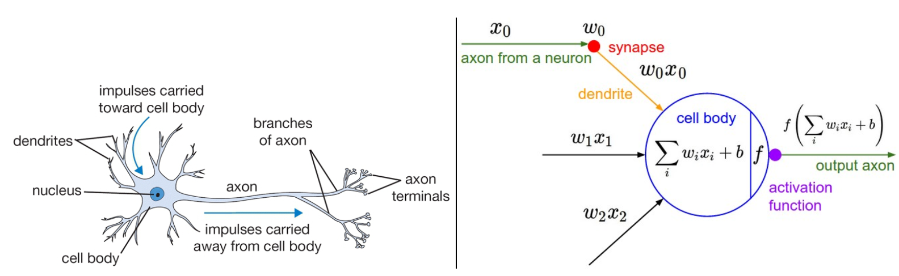
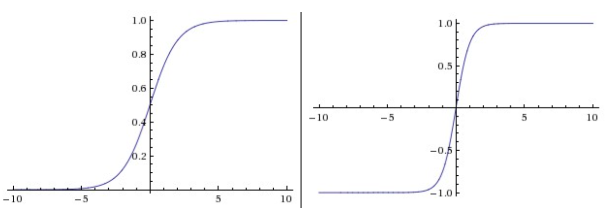
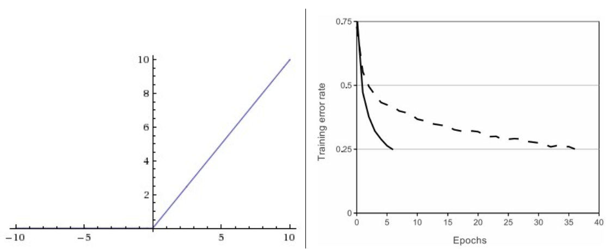
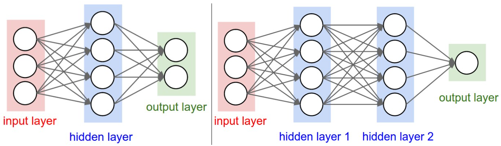
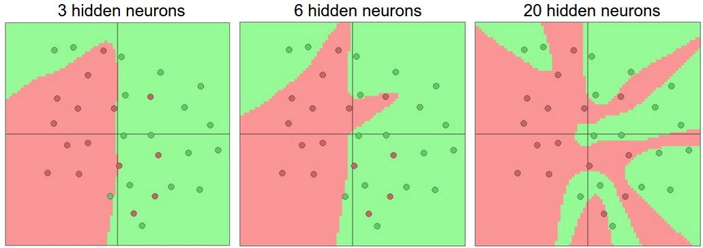

## 快速介绍

我们可以在不借助脑部类比的情况下介绍神经网络。在关于线性分类的部分，我们使用公式 $s = W x$ 根据图像计算不同视觉类别的得分，其中 $W$ 是一个矩阵，$x$ 是一个输入列向量，包含图像的所有像素数据。在CIFAR-10的情况下，$x$ 是一个 [3072x1] 的列向量，$W$ 是一个 [10x3072] 的矩阵，因此输出得分是10个类得分的向量。

一个示例的神经网络会计算 $s = W_2 \max(0, W_1 x)$。这里，$W_1$ 可以是，例如，一个 [100x3072] 的矩阵，将图像转化为一个100维的中间向量。函数 $max(0,-) $ 是逐元素应用的非线性。我们可以为非线性选择几种方法（我们将在下面研究），但这是一个常见的选择，简单地将所有低于零的激活阈值设为零。最后，矩阵 $W_2$ 的大小将是 [10x100]，这样我们再次得到10个我们解释为类得分的数字。请注意，非线性在计算上是关键的——如果我们省略它，这两个矩阵可以合并为一个矩阵，因此预测的类得分将再次是输入的线性函数。非线性就是我们得到的*波动wiggle*。参数 $W_2, W_1$ 使用随机梯度下降进行学习，它们的梯度使用链式规则推导（并使用反向传播计算）。

一个三层神经网络可以类似地看起来像 $s = W_3 \max(0, W_2 \max(0, W_1 x))$，其中所有的 $W_3, W_2, W_1$ 都是要学习的参数。中间隐藏向量的大小是网络的超参数，我们将在后面看到如何设置它们。现在让我们看看如何从神经元/网络的角度解释这些计算。

## 建模一个神经元

神经网络领域最初的主要灵感来源于模拟生物神经系统的目标，但后来出现了分歧，成为了一个工程问题，并在机器学习任务中取得了良好的结果。尽管如此，我们还是以对生物系统的非常简短和高水平的描述开始讨论，这一领域的大部分受到了其启发。

### 生物动机和联系

大脑的基本计算单元是**神经元neuron**。在人类神经系统中可以找到大约860亿个神经元，它们与大约$10^{14} - 10^{15}$ **突触synapses**相连接。下面的图表显示了一个生物神经元的卡通图（左）和一个常见的数学模型（右）。每个神经元都从其**树突dendrites**接收输入信号，并沿其（单一）**轴突axon**产生输出信号。轴突最终分叉，并通过突触连接到其他神经元的树突。在神经元的计算模型中，沿轴突传播的信号（例如 $x_0$）与基于该突触的突触强度（例如 $w_0$）的其他神经元的树突乘性地交互（例如 $w_0 x_0$）。其思想是突触的强度（权重 $w$）是可以学习的，并控制一个神经元对另一个神经元的影响的强度（及其方向：兴奋（正权重）或抑制（负权重））。在基本模型中，树突将信号传送到细胞体，它们都会被求和。如果最终的总和超过某个阈值，神经元可以*放电fire*，沿其轴突发送一个脉冲。在计算模型中，我们假设脉冲的精确时机并不重要，只有放电的频率传递信息。根据*速率代码rate code*的解释，我们使用一个**激活函数activation functio** $f$ 来建模神经元的*放电速率firing rate*，该函数代表沿轴突的脉冲频率。历史上，激活函数的常见选择是**sigmoid函数** $\sigma$，因为它接受一个实值输入（求和后的信号强度）并将其压缩到0和1之间。我们将在这一部分后面看到这些激活函数的细节。

 

  

> 生物神经元的卡通画（左）及其数学模型（右）


用于正向传播单个神经元的示例代码可能如下所示：

```python
class Neuron(object):
  # ... 
  def forward(self, inputs):
    """ assume inputs and weights are 1-D numpy arrays and bias is a number """
    cell_body_sum = np.sum(inputs * self.weights) + self.bias
    firing_rate = 1.0 / (1.0 + math.exp(-cell_body_sum)) # sigmoid activation function
    return firing_rate
```

换句话说，每个神经元与输入和它的权重进行点积运算，添加偏差并应用非线性（或激活函数），在这种情况下是sigmoid函数 $\sigma(x) = \frac{1}{1+e^{-x}}$。我们将在本节结束时更详细地讨论不同的激活函数。

**粗略模型**。需要强调的是，这种生物学神经元模型非常粗略：例如，存在许多不同类型的神经元，每种都有不同的性质。生物学神经元中的树突执行复杂的非线性计算。突触不仅仅是一个单一的权重，它们是一个复杂的非线性动态系统。许多系统中输出脉冲的确切时间已知是很重要的，这表明速率编码近似可能不成立。由于所有这些和许多其他的简化，如果你在神经网络和真实大脑之间进行类比，任何具有神经科学背景的人可能会发出抱怨。如果你感兴趣的话，可以查看这篇[综述](https://physics.ucsd.edu/neurophysics/courses/physics_171/annurev.neuro.28.061604.135703.pdf)（pdf），或者最近这篇[综述](http://www.sciencedirect.com/science/article/pii/S0959438814000130)

### 单个神经元作为线性分类器

模型神经元的前向计算的数学形式可能对你来说很熟悉。正如我们在线性分类器中看到的，一个神经元有能力“喜欢”（激活接近1）或“不喜欢”（激活接近0）其输入空间的某些线性区域。因此，通过在神经元的输出上使用适当的损失函数，我们可以将单个神经元转化为线性分类器：

**二元Softmax分类器**。例如，我们可以解释$\sigma(\sum_iw_ix_i + b)$为其中一个类的概率$P(y_i = 1 \mid x_i; w)$。另一个类的概率为$P(y_i = 0 \mid x_i; w) = 1 - P(y_i = 1 \mid x_i; w)$，因为它们的总和必须为1。有了这种解释，我们可以像在线性分类部分中看到的那样制定交叉熵损失，优化它将导致一个二元Softmax分类器（也称为*逻辑回归logistic regression*）。由于Sigmoid函数被限制在0-1之间，这个分类器的预测基于神经元的输出是否大于0.5。

**二元SVM分类器**。或者，我们可以将最大边缘铰链损失附加到神经元的输出上，并训练它成为一个二元支持向量机。

**正则化解释**。在SVM/Softmax的情况下，正则化损失在这种生物观点下可以被解释为*逐渐遗忘gradual forgetting*，因为它会在每次参数更新后使所有突触权重$w$趋向于零。

> 单个神经元可以用来实现一个二元分类器（例如，二元Softmax或二元SVM分类器）

### 常用的激活函数

每个激活函数（或*非线性函数*）接受一个数字并对其执行某种固定的数学操作。在实践中，你可能会遇到几种激活函数：

 

><b>左：</b> Sigmoid 非线性函数将实数压缩到 [0,1] 范围内 <b>右：</b> tanh 非线性函数将实数压缩到 [-1,1] 范围内。

**Sigmoid。** Sigmoid 非线性函数的数学形式为 $\sigma(x) = 1 / (1 + e^{-x})$，如上图左侧所示。正如前一节所提到的，它接受一个实值数字并将其“压缩”到0和1之间的范围。特别地，大的负数变为0，大的正数变为1。由于Sigmoid函数在历史上经常被使用，因为它可以很好地解释为神经元的发射率：从完全不发射（0）到完全饱和的最大频率发射（1）。然而在实践中，Sigmoid非线性函数近期已经不再受欢迎，很少被使用。它有两个主要的缺点：

  - *Sigmoids 饱和并杀死梯度*。Sigmoid神经元的一个非常不受欢迎的属性是，当神经元的激活在0或1的两端饱和时，这些区域的梯度几乎为零。回想一下，在反向传播过程中，这个（局部）梯度将乘以整个目标的这个门的输出的梯度。因此，如果局部梯度非常小，它将有效地“杀死”梯度，几乎没有信号会流经神经元到其权重，递归地到其数据。此外，初始化Sigmoid神经元的权重时必须特别小心，以防止饱和。例如，如果初始权重过大，那么大多数神经元将变得饱和，网络几乎不会学习。
  - *Sigmoid 输出不是零中心的*。这是不受欢迎的，因为在神经网络的后续处理层中的神经元（很快就会讲到）将接收到的数据不是零中心的。这对梯度下降的动态性有影响，因为如果进入神经元的数据总是正的（例如，在 $f = w^Tx + b$ 中 $x > 0$ 逐元素），那么在反向传播过程中权重 $w$ 上的梯度将变得全部为正或全部为负（取决于整个表达式 $f$ 的梯度）。这可能会在权重的梯度更新中引入不受欢迎的锯齿状动态。但是，注意，一旦这些梯度在一批数据上加起来，权重的最终更新可以有可变的符号，这在一定程度上缓解了这个问题。因此，这是一个不便，但与上面的饱和激活问题相比，它的后果较为轻微。

**Tanh。** Tanh 非线性函数如上图右侧所示。它将实值数字压缩到[-1, 1]范围。像Sigmoid神经元一样，它的激活会饱和，但与Sigmoid神经元不同，它的输出是零中心的。因此，在实践中，*tanh 非线性函数总是优于 Sigmoid 非线性函数*。还要注意，tanh 神经元只是一个缩放的Sigmoid神经元，特别地，以下关系成立：$\tanh(x) = 2 \sigma(2x) -1$。

 

><b>左：</b> 修正线性单元（ReLU）激活函数，当 x < 0 时为零，当 x > 0 时与斜率为1的线性函数相同。 <b>右：</b> 来自 <a href="http://www.cs.toronto.edu/~fritz/absps/imagenet.pdf">Krizhevsky 等人</a>（pdf）的论文中的一个图表，显示与 tanh 单元相比，ReLU 单元在收敛上有6倍的改进。

**ReLU。** 在过去的几年中，修正线性单元（ReLU）变得非常受欢迎。它计算的函数为 $f(x) = \max(0, x)$。换句话说，激活简单地在零处阈值化（如上图左侧所示）。使用ReLU有以下优缺点：

- (+) 与sigmoid/tanh函数相比，发现ReLU大大加速了随机梯度下降的收敛（例如，[Krizhevsky等人](http://www.cs.toronto.edu/~fritz/absps/imagenet.pdf)中的6倍因子）。人们认为这是由于其线性、非饱和形式。
- (+) 与涉及昂贵操作的tanh/sigmoid神经元（指数等）相比，ReLU可以通过简单地在零处阈值化激活矩阵来实现。
- (-) 不幸的是，ReLU单元在训练过程中可能会变得脆弱并且可能“死亡”。例如，流经ReLU神经元的大梯度可能导致权重更新，使得神经元永远不会在任何数据点上激活。如果发生这种情况，那么从那时起，流经该单元的梯度将永远为零。也就是说，ReLU单元可以在训练过程中不可逆地死亡，因为它们可能会被从数据流中移除。例如，如果学习率设置得过高，你可能会发现你的网络中多达40%的部分可能是“死的”（即，在整个训练数据集中从未激活的神经元）。但是，通过适当地设置学习率，这个问题就不那么频繁了。

**Leaky ReLU。** Leaky ReLU是修复“死亡ReLU”问题的一种尝试。当x < 0时，函数不为零，而是有一个小的正斜率（如0.01）。也就是说，该函数计算 $f(x) = \mathbb{1}(x < 0) (\alpha x) + \mathbb{1}(x>=0) (x)$，其中$\alpha$是一个小常数。有些人报告说这种激活函数很成功，但结果并不总是一致的。在2015年由Kaiming He等人介绍的[深入研究整流器](http://arxiv.org/abs/1502.01852)中，可以看到负区域的斜率也可以作为每个神经元的参数，如PReLU神经元。然而，这种好处在不同任务中的一致性目前尚不清楚。

**Maxout**。已经提出了其他类型的单元，它们没有函数形式 $f(w^Tx + b)$，其中在权重和数据之间的点积上应用非线性。一个相对受欢迎的选择是Maxout神经元（最近由[Goodfellow等人](https://arxiv.org/abs/1302.4389)引入），它概括了ReLU及其leaky版本。Maxout神经元计算函数$\max(w_1^Tx+b_1, w_2^Tx + b_2)$。注意，ReLU和Leaky ReLU都是这种形式的特例（例如，对于ReLU，我们有$w_1, b_1 = 0$）。因此，Maxout神经元享有ReLU单元的所有好处（操作的线性区域，没有饱和）并且没有其缺点（死亡ReLU）。然而，与ReLU神经元不同，它使每个单一神经元的参数数量翻倍，导致参数总数很高。

这结束了我们对最常见的神经元及其激活函数的讨论。最后一点，很少在同一个网络中混合使用不同类型的神经元，尽管这样做没有根本问题。

**简而言之**：“*我应该使用哪种神经元类型？*” 使用ReLU非线性函数，小心你的学习率，并可能监控网络中“死亡”单元的比例。如果这让你担忧，尝试使用Leaky ReLU或Maxout。永远不要使用sigmoid。尝试tanh，但期望它的工作效果比ReLU/Maxout差。

## 神经网络架构

### 分层组织

**神经网络作为图中的神经元**。神经网络被模型化为以非循环图形式连接的神经元的集合。换句话说，某些神经元的输出可以成为其他神经元的输入。不允许有循环，因为这将意味着网络前向传播中的无限循环。神经网络模型通常被组织成不同层的神经元。对于常规神经网络，最常见的层类型是**全连接层fully-connected layer**，其中两个相邻层之间的神经元是完全成对连接的，但单个层内的神经元没有共享连接。以下是使用一堆全连接层的两个示例神经网络拓扑结构：



><b>左：</b> 一个2层神经网络（一个包含4个神经元（或单元）的隐藏层和一个包含2个神经元的输出层），以及三个输入。 <b>右：</b> 一个3层神经网络，有三个输入，两个每层有4个神经元的隐藏层和一个输出层。请注意，在这两种情况下，层与层之间的神经元都有连接（突触），但层内部没有连接。

**命名约定。** 请注意，当我们说N层神经网络时，我们不计算输入层。因此，单层神经网络描述的是一个没有隐藏层的网络（输入直接映射到输出）。从这个意义上说，你有时会听到人们说逻辑回归或SVMs只是单层神经网络的一个特例。你也可能听到这些网络被交替地称为*"人工神经网络Artificial Neural Networks"*（ANN）或*"多层感知机Multi-Layer Perceptrons"*（MLP）。许多人不喜欢神经网络和真实大脑之间的类比，并更喜欢将神经元称为*单元*。

**输出层。** 与神经网络中的所有层不同，输出层神经元通常没有激活函数（或者你可以认为它们有一个线性身份激活函数）。这是因为最后的输出层通常被用来表示类得分（例如，在分类中），这些是任意的实值数字，或某种实值目标（例如，在回归中）。

**神经网络的大小**。人们常用来衡量神经网络大小的两个指标是神经元的数量，或更常见的是参数的数量。使用上图中的两个示例网络：

- 第一个网络（左）有4 + 2 = 6个神经元（不计算输入），[3 x 4] + [4 x 2] = 20个权重和4 + 2 = 6个偏置，总共有26个可学习的参数。
- 第二个网络（右）有4 + 4 + 1 = 9个神经元，[3 x 4] + [4 x 4] + [4 x 1] = 12 + 16 + 4 = 32个权重和4 + 4 + 1 = 9个偏差，总共有41个可学习的参数。

给你一些背景，现代卷积网络包含大约1亿个参数，通常由大约10-20层组成（因此叫*深度学习*）。然而，由于参数共享，我们将看到*有效effective*连接的数量显著增加。在卷积神经网络模块中会有更多内容。

### 前向计算例子

*交织激活函数的重复矩阵乘法Repeated matrix multiplications interwoven with activation function*。神经网络被组织成层的主要原因之一是，这种结构使得使用矩阵向量操作评估神经网络变得非常简单和高效。使用上图中的示例三层神经网络，输入将是一个[3x1]向量。一个层的所有连接强度都可以存储在一个单独的矩阵中。例如，第一个隐藏层的权重`W1`将是[4x3]的大小，所有单元的偏差将在向量`b1`中，大小为[4x1]。在这里，每个单一神经元都在`W1`的一行中有其权重，所以矩阵向量乘法`np.dot(W1,x)`评估该层所有神经元的激活。同样，`W2`将是一个[4x4]的矩阵，存储第二个隐藏层的连接，`W3`是最后一个（输出）层的[1x4]矩阵。然后，这个3层神经网络的完整前向传递只是三个矩阵乘法，交织着激活函数的应用：

```python
# forward-pass of a 3-layer neural network:
f = lambda x: 1.0/(1.0 + np.exp(-x)) # activation function (use sigmoid)
x = np.random.randn(3, 1) # random input vector of three numbers (3x1)
h1 = f(np.dot(W1, x) + b1) # calculate first hidden layer activations (4x1)
h2 = f(np.dot(W2, h1) + b2) # calculate second hidden layer activations (4x1)
out = np.dot(W3, h2) + b3 # output neuron (1x1)
```

在上述代码中，`W1，W2，W3，b1，b2，b3` 是网络的可学习参数。还要注意，与其拥有单个输入列向量不同，变量 `x` 可以容纳整个批次的训练数据（其中每个输入示例都将是 `x` 的一列），然后所有示例将以并行方式进行高效评估。请注意，最后的神经网络层通常没有激活函数（例如，在分类设置中它代表一个（实值）类别分数）。

> 全连接层的前向传播对应于矩阵乘法，后跟偏置偏移和激活函数。

### 表示能力

观察具有完全连接层的神经网络的一种方式是，它们定义了一组由网络的权重参数化的函数。一个自然而然的问题是：这组函数的表示能力如何？特别是，是否存在不能用神经网络建模的函数？

事实证明，至少具有一个隐藏层的神经网络是*通用逼近器universal approximators*。也就是说，可以证明（例如，参见 1989 年的[*Sigmoidal Function的叠加逼近*](http://www.dartmouth.edu/~gvc/Cybenko_MCSS.pdf)（pdf），或者是 Michael Nielsen 的这个[直观解释](http://neuralnetworksanddeeplearning.com/chap4.html)），对于任何连续函数 $f(x)$ 和一些 $\epsilon > 0$，都存在一个具有一个隐藏层的神经网络 $g(x)$（具有合理选择的非线性，例如 sigmoid 函数），使得 $ \forall x, \mid f(x) - g(x) \mid < \epsilon $。换句话说，神经网络可以逼近任何连续函数。

如果一个隐藏层足以逼近任何函数，为什么要使用更多层并加深网络呢？答案是，尽管数学上可爱，但两层神经网络是通用逼近器，实际上在实践中是一个相对弱而无用的说法。在一维情况下，“指示器突起的总和sum of indicator bumps”函数 $g(x) = \sum_i c_i \mathbb{1}(a_i < x < b_i)$，其中 $a,b,c$ 是参数向量，也是通用逼近器，但没有人会建议在机器学习中使用这种函数形式。神经网络在实践中表现良好，因为它们紧凑地表示与我们在实践中遇到的数据的统计属性相符合的漂亮、平滑函数，并且还容易使用我们的优化算法（例如梯度下降）进行学习。同样，深层网络（具有多个隐藏层）可以比单隐藏层网络效果更好，尽管它们的表示能力相等。

值得一提的是，实际上，通常情况下，3层神经网络会优于2层网络，但更深层次（4、5、6层）很少有更大的帮助。这与卷积网络形成了鲜明对比，深度在其中被发现是一个极其重要的组成部分，用于构建出色的识别系统（例如，约有10个可学习层次）。对于这一观察的一个论点是，图像包含层次结构（例如，脸由眼睛组成，眼睛由边缘组成等），因此对于这个数据领域，**多层次处理**是直观的。

当然，完整的故事远比这复杂得多，也是最近研究的一个重要主题。如果您对这些话题感兴趣，我们建议进一步阅读：

- Bengio、Goodfellow、Courville 编写的[Deep Learning](http://www.deeplearningbook.org/)书，特别是[第6.4章](http://www.deeplearningbook.org/contents/mlp.html)。
- [深度网络真的需要深吗？](http://arxiv.org/abs/1312.6184)
- [FitNets: Thin Deep Nets的提示](http://arxiv.org/abs/1412.6550)

### 设置层数和它们的大小

当面临实际问题时，我们如何决定使用什么样的体系结构？我们应该不使用隐藏层吗？使用一个隐藏层？两个隐藏层？每个层应该有多大？首先，请注意，随着神经网络中层的大小和数量的增加，网络的**容量capacity**也会增加。也就是说，可表示函数的空间会增大，因为神经元可以协作来表示许多不同的函数。例如，假设我们在二维上有一个二元分类问题。我们可以训练三个单独的神经网络，每个都有一个隐藏层的某个大小，并得到以下分类器：



> 更大的神经网络可以表示更复杂的函数。数据显示为按其类别着色的圆圈，而经过训练的神经网络的决策区域显示在下方。您可以在这个[ConvNetsJS演示链接](http://cs.stanford.edu/people/karpathy/convnetjs/demo/classify2d.html)中对这些示例进行互动。

在上面的图表中，我们可以看到具有更多神经元的神经网络可以表示更复杂的函数。然而，这既是一种好处（因为我们可以学会分类更复杂的数据），也是一种诅咒（因为更容易过拟合训练数据）。**过拟合Overfitting**发生在高容量模型拟合数据中的噪声而不是（假定的）潜在关系时。例如，具有20个隐藏神经元的模型拟合了所有训练数据，但以将空间分割成许多不相交的红色和绿色决策区域为代价。具有3个隐藏神经元的模型只有在宏观上具有分类数据的表现能力。它将数据建模为两个斑点，并将绿色集群内的少数红点解释为**异常值outliers**（噪声）。在实践中，这可能导致在测试集上更好的**泛化generalization**。

根据我们上面的讨论，似乎如果数据不够复杂以防止过拟合，那么可以首选较小的神经网络。然而，这是不正确的 ——在神经网络中，有许多其他首选方法可以防止过拟合，我们将在后面讨论（例如L2正则化、丢弃dropout、输入噪声等）。实际上，始终<font color="red">最好使用这些方法来控制过拟合，而不是调整神经元的数量</font>。

这背后的微妙原因是，较小的网络更难使用诸如梯度下降之类的局部方法进行训练：很明显，它们的损失函数具有相对较少的局部最小值，但事实证明，其中许多最小值更容易收敛，并且它们是糟糕的（即具有较高的损失）。相反，更大的神经网络包含明显更多的局部最小值，但这些最小值在实际损失方面要好得多。由于神经网络是非凸的，因此在数学上研究这些属性很困难，但一些尝试理解这些目标函数的工作已经进行，例如最近的一篇论文[多层网络的损失曲面The Loss Surfaces of Multilayer Networks](http://arxiv.org/abs/1412.0233)。在实践中，您会发现，如果训练一个小型网络，最终的损失可能会显示出相当大的方差——在某些情况下，您会幸运地收敛到一个好的位置，但在某些情况下，您会陷入其中一个不好的局部最小值。另一方面，如果训练一个大型网络，您将开始找到许多不同的解决方案，但最终实现的损失方差会小得多。换句话说，所有解决方案都差不多一样好，而不太依赖于随机初始化的运气。

再次强调，<font color="red">正则化强度regularization strength是控制神经网络过拟合的首选方法</font>。我们可以查看三种不同设置所达到的结果：

 

>正则化强度的影响：上面的每个神经网络都有20个隐藏神经元，但改变正则化强度会使其最终的决策区域更加平滑。您可以在这个[ConvNetsJS演示链接](http://cs.stanford.edu/people/karpathy/convnetjs/demo/classify2d.html)中对这些示例进行互动。

**结论是，您不应该因为担心过拟合而使用较小的神经网络。相反，您应该尽可能使用较大的神经网络，只要您的计算预算允许，并使用其他正则化技术来控制过拟合。**

## 总结

总结一下，

- 我们引入了生物**神经元**的一个非常粗略的模型。
- 我们讨论了实践中使用的几种**激活函数**，其中ReLU是最常见的选择。
- 我们引入了**神经网络**，其中神经元通过**全连接层**相连，相邻层的神经元具有全对全的连接，但同一层的神经元之间没有连接。
- 我们看到这种分层体系结构使得基于矩阵乘法与激活函数的应用之间的神经网络非常高效。
- 我们看到神经网络是**通用函数逼近器**，但我们也讨论了这一属性与它们的广泛使用之间的关系较小。它们之所以使用，是因为它们对实践中出现的函数的功能形式做出了某些“正确”的假设。
- 我们讨论了较大的网络将始终比较小的网络效果更好，但必须适当地采用更强的正则化（例如更高的权重衰减），否则可能会过拟合。在后面的部分中，我们将看到更多形式的正则化（特别是dropout）。

## 其他参考资料

- [deeplearning.net教程](http://www.deeplearning.net/tutorial/mlp.html)（使用Theano）
- 用于直观理解的[ConvNetJS](http://cs.stanford.edu/people/karpathy/convnetjs/)演示
- [Michael Nielsen的教程](http://neuralnetworksanddeeplearning.com/chap1.html)

