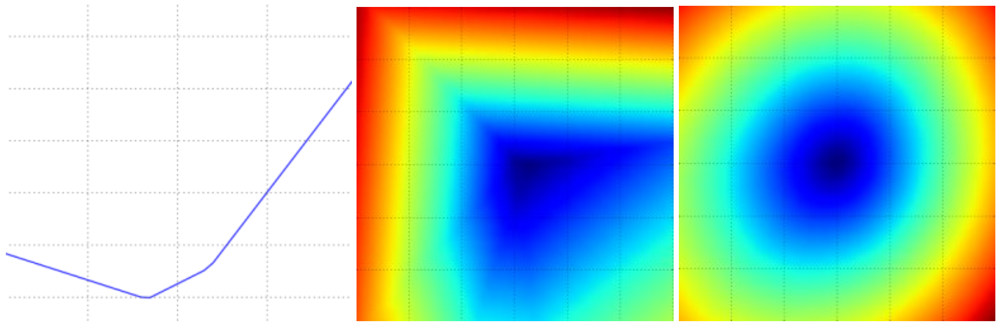

### 引言

在前一节中，我们在图像分类任务的背景下介绍了两个关键组成部分：

1. 一个（参数化的）**分数函数**，将原始图像像素映射到类别分数（例如，一个线性函数）。
2. 一个**损失函数**，根据感知分数induced scores与训练数据中的真实标签的一致性来衡量特定参数集的质量。我们看到有许多方法和版本可以用来实现这个目标（例如Softmax/SVM）。

具体来说，回想一下线性函数的形式为 $ f(x_i, W) =  W x_i $，我们开发的SVM被公式化为：


$$
L = \frac{1}{N} \sum_i \sum_{j\neq y_i} \left[ \max(0, f(x_i; W)_j - f(x_i; W)_{y_i} + 1) \right] + \alpha R(W)
$$

我们看到，产生与示例 $x_i$ 的基础真实标签 $y_i$ 一致的参数 $W$ 的设置也将具有非常低的损失 $L$。现在，我们将介绍第三个和最后一个关键组成部分：**优化**。优化是找到最小化损失函数的参数 $W$ 集合的过程。

**铺垫：**一旦我们了解了这三个核心组件是如何相互作用的，我们将重新审视第一个组件（参数化函数映射），并将其扩展到比线性映射复杂得多的函数：首先是整个神经网络，然后是卷积神经网络。损失函数和优化过程将保持相对不变。

### 可视化损失函数

在本课程中，我们将研究的损失函数通常定义在非常高维的空间中（例如，在CIFAR-10中，线性分类器的权重矩阵的大小为[10 x 3073]，总共有30,730个参数），使得它们很难可视化。然而，我们仍然可以通过沿着光线rays（1维）或平面（2维）切割高维空间来获得一些关于它们的直观感受。例如，我们可以生成一个随机的权重矩阵$W$（对应于空间中的一个点），然后沿着一条光线前进并记录沿途的损失函数值。也就是说，我们可以生成一个随机方向$W_1$，并通过评估不同$a$值的$L(W + a W_1)$来沿着这个方向计算损失。这个过程生成一个简单的绘图，其中$a$值作为x轴，损失函数值作为y轴。我们还可以通过在二维空间中评估损失 $ L(W + a W_1 + b W_2) $ 来以相同的方式执行两个维度的过程，当我们改变 $a, b$ 时，$a, b$ 可以对应于x轴和y轴，并且可以使用颜色来可视化损失函数的值：

 

> 这是一个多类别SVM（无正则化）的损失函数图景，其中包括CIFAR-10中的一个单一示例（左、中）和一百个示例（右）。左图：仅通过变化 <b>a</b> 来获得的一维损失。中、右图：损失的二维切片，蓝色=低损失，红色=高损失。请注意损失函数的分段线性结构。多个示例的损失是通过平均组合的，因此右图的碗形是许多分段线性碗（例如中间的碗）的平均值。

我们可以通过检查数学公式来解释损失函数的分段线性结构。对于单个示例，我们有：


$$
L_i = \sum_{j\neq y_i} \left[ \max(0, w_j^Tx_i - w_{y_i}^Tx_i + 1) \right]
$$

从方程式中可以清楚地看出，每个示例的数据损失是 $W$ 的线性函数之和（由于 $\max(0,-)$ 函数的零阈值）。此外，$W$ 的每一行（即 $w_j$）有时候在其前面有正号（当它对应于示例的错误类别时），有时候有负号（当它对应于该示例的正确类别时）。为了更加明确这一点，考虑一个包含三个一维点和三个类别的简单数据集。不带正则化的完整SVM损失变成了：


$$
\begin{align}
L_0 = & \max(0, w_1^Tx_0 - w_0^Tx_0 + 1) + \max(0, w_2^Tx_0 - w_0^Tx_0 + 1) \\\\
L_1 = & \max(0, w_0^Tx_1 - w_1^Tx_1 + 1) + \max(0, w_2^Tx_1 - w_1^Tx_1 + 1) \\\\
L_2 = & \max(0, w_0^Tx_2 - w_2^Tx_2 + 1) + \max(0, w_1^Tx_2 - w_2^Tx_2 + 1) \\\\
L = & (L_0 + L_1 + L_2)/3
\end{align}
$$

由于这些示例是一维的，数据 $x_i$ 和权重 $w_j$ 都是数字。以 $w_0$ 为例，上述某些项是 $w_0$ 的线性函数，每个项都在零处被截断。我们可以将其可视化如下：

 

>1维图示数据损失。x轴是单个权重，y轴是损失。数据损失是多个项的总和，每个项要么与特定权重无关，要么是它的线性函数，被截断为零。完整的SVM数据损失是这个形状的30,730维版本。

作为一个旁注，你可能已经从它的碗状外观猜到了SVM成本函数是[凸函数convex function](http://en.wikipedia.org/wiki/Convex_function)的一个例子。有大量的文献致力于高效地最小化这类函数，你还可以参加斯坦福的一门课程（[凸优化convex optimization](http://stanford.edu/~boyd/cvxbook/)）。一旦我们将得分函数$f$扩展到神经网络，我们的目标函数将变成非凸函数，上面的可视化将不再呈现碗状，而是复杂而崎岖的地形。

*不可微Non-differentiable损失函数*。作为一个技术说明，你还可以看到损失函数中的*拐点kinks*（由于max操作）在技术上使得损失函数不可微，因为在这些拐点处梯度未被定义。然而，[次梯度subgradient](http://en.wikipedia.org/wiki/Subderivative)仍然存在并且通常被使用。在这门课程中，我们将互换使用*次梯度*和*梯度*这两个术语。

### 优化

再次强调，损失函数允许我们量化任何特定权重**W**的质量。优化的目标是找到最小化损失函数的**W**。我们现在将激励并慢慢开发一种优化损失函数的方法。对于那些具有以前经验的人来说，这部分可能看起来有些奇怪，因为我们将使用的工作示例（SVM损失）是一个凸问题，但请记住我们的目标是最终优化神经网络，在那里我们不能轻松使用凸优化文献中开发的任何工具。

#### 策略＃1：一个非常糟糕的解决方案：随机搜索

由于检查给定的权重**W**如此简单，可能会首先（非常糟糕）想到的一个想法是尝试许多不同的随机权重，然后跟踪哪个效果最好。该过程可能如下所示：

```python
# assume X_train is the data where each column is an example (e.g. 3073 x 50,000)
# assume Y_train are the labels (e.g. 1D array of 50,000)
# assume the function L evaluates the loss function

bestloss = float("inf") # Python assigns the highest possible float value
for num in range(1000):
  W = np.random.randn(10, 3073) * 0.0001 # generate random parameters
  loss = L(X_train, Y_train, W) # get the loss over the entire training set
  if loss < bestloss: # keep track of the best solution
    bestloss = loss
    bestW = W
  print 'in attempt %d the loss was %f, best %f' % (num, loss, bestloss)

# prints:
# in attempt 0 the loss was 9.401632, best 9.401632
# in attempt 1 the loss was 8.959668, best 8.959668
# in attempt 2 the loss was 9.044034, best 8.959668
# in attempt 3 the loss was 9.278948, best 8.959668
# in attempt 4 the loss was 8.857370, best 8.857370
# in attempt 5 the loss was 8.943151, best 8.857370
# in attempt 6 the loss was 8.605604, best 8.605604
# ... (trunctated: continues for 1000 lines)
```

在上面的代码中，我们可以看到我们尝试了几个随机的权重向量**W**，其中一些比其他的效果好。我们可以取在这次搜索中找到的最佳权重**W**，然后在测试集上尝试它：

```python
# Assume X_test is [3073 x 10000], Y_test [10000 x 1]
scores = Wbest.dot(Xte_cols) # 10 x 10000, the class scores for all test examples
# find the index with max score in each column (the predicted class)
Yte_predict = np.argmax(scores, axis = 0)
# and calculate accuracy (fraction of predictions that are correct)
np.mean(Yte_predict == Yte)
# returns 0.1555
```

最佳的**W**可以获得约**15.5%**的准确率。考虑到完全随机猜测类别只能达到10%，对于这种毫无头绪的随机搜索解决方案来说，这并不是一个非常糟糕的结果！

**核心思想：迭代优化**。当然，事实证明我们可以做得更好。核心思想是找到最佳权重**W**是一个非常困难甚至不可能的问题（特别是一旦**W**包含了整个复杂神经网络的权重），但将特定的权重**W**进行微调以使其略微改善的问题要容易得多。换句话说，我们的方法将是从随机的**W**开始，然后迭代地对其进行改进，使其每次都略微改善。

> 我们的策略是从随机权重开始，然后随着时间的推移迭代地对其进行改进，以获得更低的损失

**盲目的徒步旅行者比喻**。一个有用的类比是将自己看作是在一个多山的地形上徒步，而且双眼被蒙住，试图到达底部。在CIFAR-10的例子中，这些山是30,730维的，因为**W**的维度是10 x 3073。在山上的每一点，我们都会达到特定的损失（地形的高度）。

#### 策略#2：随机本地搜索

你可能会想到的第一种策略是尝试沿着随机方向延伸一只脚，然后只有当它向下倾斜时才迈出一步。具体来说，我们将从随机的$W$开始，生成对其的随机扰动$\delta W$，如果扰动后的$W + \delta W$处的损失更低，我们将执行更新。这个过程的代码如下：

```python
W = np.random.randn(10, 3073) * 0.001 # generate random starting W
bestloss = float("inf")
for i in range(1000):
  step_size = 0.0001
  Wtry = W + np.random.randn(10, 3073) * step_size
  loss = L(Xtr_cols, Ytr, Wtry)
  if loss < bestloss:
    W = Wtry
    bestloss = loss
  print 'iter %d loss is %f' % (i, bestloss)
```

使用与之前相同数量的损失函数评估（1000次），这种方法实现了**21.4%**的测试集分类准确率。这比之前好一些，但仍然浪费和计算昂贵。

#### 策略 #3：跟随梯度

在前一节中，我们试图找到一个在权重空间中可以改进我们的权重向量的方向（并为我们提供更低的损失）的方向。事实证明，没有必要随机搜索一个好的方向：我们可以计算出一个最佳方向，我们应该改变我们的权重向量，这个方向在数学上被保证是最陡下降的方向（至少在步长趋向于零时）。这个方向与损失函数的**梯度gradient**有关。在我们的徒步旅行类比中，这种方法大致对应于感觉到脚下的山坡，并朝着感觉最陡的方向前进。

在一维函数中，斜率是你可能感兴趣的任何点的函数的瞬时变化率。梯度是对不仅接受单个数字而且接受一组数字的函数的斜率的一种概括。此外，梯度只是输入空间中每个维度的斜率的向量（更常被称为**导数derivatives**）。关于其输入的1-D函数的导数的数学表达式如下：


$$
\frac{df(x)}{dx} = \lim_{h\ \to 0} \frac{f(x + h) - f(x)}{h}
$$

当我们感兴趣的函数接受一组数字而不是单个数字时，我们将导数称为**偏导数partial derivatives**，梯度只是每个维度中的偏导数的向量。

### 计算梯度

有两种计算梯度的方法：一种是慢速、近似但容易的方法（**数值梯度numerical gradient**），另一种是快速、精确但更容易出错的方法，需要微积分（**解析梯度analytic gradient**）。我们现在将介绍这两种方法。

#### 使用有限差分finite differences数值计算梯度

上面给出的公式允许我们通过数值方法计算梯度。这是一个通用函数，它接受一个函数`f`、要在其上评估梯度的向量`x`，并返回在`x`处`f`的梯度：

```python
def eval_numerical_gradient(f, x):
  """
  a naive implementation of numerical gradient of f at x
  - f should be a function that takes a single argument
  - x is the point (numpy array) to evaluate the gradient at
  """

  fx = f(x) # evaluate function value at original point
  grad = np.zeros(x.shape)
  h = 0.00001

  # iterate over all indexes in x
  it = np.nditer(x, flags=['multi_index'], op_flags=['readwrite'])
  while not it.finished:

    # evaluate function at x+h
    ix = it.multi_index
    old_value = x[ix]
    x[ix] = old_value + h # increment by h
    fxh = f(x) # evalute f(x + h)
    x[ix] = old_value # restore to previous value (very important!)

    # compute the partial derivative
    grad[ix] = (fxh - fx) / h # the slope
    it.iternext() # step to next dimension

  return grad
```

按照我们上面给出的梯度公式，上面的代码逐个维度迭代，沿着该维度进行小的变化`h`，并通过查看函数变化了多少来计算该维度上损失函数的偏导数。最终，变量`grad`保存了完整的梯度。

**实际考虑**。请注意，在数学公式中，梯度的定义是在**h**趋近于零的极限情况下，但在实际应用中，通常可以使用非常小的值（例如示例中的1e-5）。理想情况下，您希望使用不会导致数值问题的最小步长。此外，在实践中，使用**中心差分公式centered difference formula**计算数值梯度通常效果更好：$ [f(x+h) - f(x-h)] / 2 h $ 。详细信息请参阅[维基](http://en.wikipedia.org/wiki/Numerical_differentiation)。

我们可以使用上面提供的函数来计算任何点和任何函数的梯度。让我们计算CIFAR-10损失函数在权重空间中的某个随机点的梯度：

```python

# to use the generic code above we want a function that takes a single argument
# (the weights in our case) so we close over X_train and Y_train
def CIFAR10_loss_fun(W):
  return L(X_train, Y_train, W)

W = np.random.rand(10, 3073) * 0.001 # random weight vector
df = eval_numerical_gradient(CIFAR10_loss_fun, W) # get the gradient
```

梯度告诉我们损失函数沿每个维度的斜率，我们可以使用它进行更新：

```python
loss_original = CIFAR10_loss_fun(W) # the original loss
print 'original loss: %f' % (loss_original, )

# lets see the effect of multiple step sizes
for step_size_log in [-10, -9, -8, -7, -6, -5,-4,-3,-2,-1]:
  step_size = 10 ** step_size_log
  W_new = W - step_size * df # new position in the weight space
  loss_new = CIFAR10_loss_fun(W_new)
  print 'for step size %f new loss: %f' % (step_size, loss_new)

# prints:
# original loss: 2.200718
# for step size 1.000000e-10 new loss: 2.200652
# for step size 1.000000e-09 new loss: 2.200057
# for step size 1.000000e-08 new loss: 2.194116
# for step size 1.000000e-07 new loss: 2.135493
# for step size 1.000000e-06 new loss: 1.647802
# for step size 1.000000e-05 new loss: 2.844355
# for step size 1.000000e-04 new loss: 25.558142
# for step size 1.000000e-03 new loss: 254.086573
# for step size 1.000000e-02 new loss: 2539.370888
# for step size 1.000000e-01 new loss: 25392.214036
```

**朝着负梯度方向更新**。请注意，在上面的代码中，为了计算`W_new`，我们是在梯度`df`的负方向上进行更新的，因为我们希望我们的损失函数减小，而不是增加。

**步长step的影响**。梯度告诉我们函数具有最快增加速率的方向，但它不告诉我们沿着这个方向应该迈多远的一步。正如我们将在本课程的后期看到的那样，选择步长（也称为*学习率learning rate*）将成为训练神经网络中最重要（也是最头疼的）的超参数设置之一。在我们的盲目下坡下降比喻中，我们感觉到脚下的山坡朝某个方向倾斜，但我们应该迈多远的一步是不确定的。如果我们小心翼翼地挪动脚步，我们可以期望取得一致但非常小的进展（这对应于采用小步长）。相反，我们可以选择迈出大步，以更快地下降，但这可能得不偿失。正如您在上面的代码示例中看到的那样，有一些时候采取更大的步骤会导致更高的损失，因为我们“越过了目标”。

 

>可视化步长的影响。我们从某个特定的位置W开始，并计算梯度（或更确切地说，它的负值 - 白色箭头），它告诉我们损失函数中最陡峭的减小方向。小步骤可能会导致稳定但缓慢的进展。大步骤可以导致更好的进展，但更加冒险。请注意，最终，对于大步长，我们会越过目标，使损失变得更糟。步长（或者我们以后将称之为**学习率**）将成为我们必须仔细调整的最重要的超参数之一。

**效率问题**。您可能已经注意到，计算数值梯度的复杂度与参数数量呈线性关系。在我们的示例中，总共有30730个参数，因此我们需要对损失函数进行30731次评估，以计算梯度并执行单个参数更新。这个问题只会变得更糟，因为现代神经网络很容易有数千万个参数。显然，这种策略不具备可扩展性，我们需要更好的方法。

#### 使用微积分Calculus解析计算梯度

数值梯度使用有限差分逼近非常简单，但缺点是它是近似的（因为我们必须选择一个较小的*h*值，而真正的梯度定义为*h*趋近于零的极限），并且计算起来非常昂贵。第二种计算梯度的方法是使用微积分进行分析，它允许我们导出梯度的直接公式（没有近似），而且计算速度也非常快。然而，与数值梯度不同，它在实现时更容易出错，这就是为什么在实践中非常常见的是计算分析梯度并将其与数值梯度进行比较以检查实现的正确性。这被称为**梯度检查gradient check**。

让我们以单个数据点的SVM损失函数为例：


$$
L_i = \sum_{j\neq y_i} \left[ \max(0, w_j^Tx_i - w_{y_i}^Tx_i + \Delta) \right]
$$

我们可以针对权重计算梯度。例如，针对$w_{y_i}$计算梯度，我们得到：


$$
\nabla_{w_{y_i}} L_i = - \left( \sum_{j\neq y_i} \mathbb{1}(w_j^Tx_i - w_{y_i}^Tx_i + \Delta > 0) \right) x_i
$$

其中$\mathbb{1}$是指示函数，如果内部条件为真，则为1，否则为零。虽然在书写时这个表达式可能看起来吓人，但在代码中实现时，您只需计算未满足所需间隔的类别数量（从而有利于损失函数），然后数据向量$x_i$乘以此数字即为梯度。请注意，这只是与正确类别对应的$W$行的梯度。对于其他行，其中$j \neq y_i$，梯度是：


$$
\nabla_{w_j} L_i = \mathbb{1}(w_j^Tx_i - w_{y_i}^Tx_i + \Delta > 0) x_i
$$

一旦您导出了梯度的表达式，实现这些表达式并使用它们执行梯度更新就很简单了。

### 梯度下降

现在我们可以计算损失函数的梯度了，反复评估梯度然后执行参数更新的过程被称为*梯度下降Gradient Descent*。其**普通vanilla**版本如下所示：

```python
# Vanilla Gradient Descent

while True:
  weights_grad = evaluate_gradient(loss_fun, data, weights)
  weights += - step_size * weights_grad # perform parameter update
```

这个简单的循环是所有神经网络库的核心。有其他方法可以执行优化（例如LBFGS），但梯度下降目前是迄今为止**最常见和最成熟**的优化神经网络损失函数的方法。在整个课程中，我们将对这个循环的细节进行一些改进（例如更新方程的详细细节），但跟随梯度直到我们满意结果的核心思想将保持不变。

**小批量梯度下降**。在大规模应用中（例如ILSVRC挑战赛），训练数据可能有数百万个示例。因此，为了执行单个参数更新，计算整个训练集上的完整损失函数似乎是一种浪费。解决这个问题的一个非常常见的方法是计算**批量batches**训练数据的梯度。例如，在当前最先进的卷积神经网络ConvNets中，一个典型的批量包含来自整个120万个训练集的256个示例。然后使用这个批量来执行参数更新：

```python
# Vanilla Minibatch Gradient Descent

while True:
  data_batch = sample_training_data(data, 256) # sample 256 examples
  weights_grad = evaluate_gradient(loss_fun, data_batch, weights)
  weights += - step_size * weights_grad # perform parameter update
```

这个方法之所以有效，是因为训练数据中的示例是**相关的**。要理解这一点，考虑一个极端情况，即ILSVRC中的所有120万幅图像实际上都由1000幅唯一图像的精确副本组成（每个类别一个，换句话说，每幅图像有1200个相同的副本）。那么很明显，我们为所有1200个相同副本计算的梯度都是相同的，当我们将所有120万幅图像上的数据损失平均时，得到的损失与仅在1000个小子集上评估时得到的损失完全相同。当然，在实践中，数据集不会包含重复的图像，小批量的梯度很好地近似于整个目标函数objective的梯度。因此，在实践中，通过评估小批量梯度以执行更频繁的参数更新，可以实现更快的收敛。

这个过程的极端情况是小批量只包含一个示例。这个过程被称为**随机梯度下降Stochastic Gradient Descent（SGD）**（有时也称为**在线on-line**梯度下降）。这种情况相对不太常见，因为在实践中，由于矢量化代码优化，评估100个示例的梯度通常比100次评估一个示例的梯度计算效率更高。尽管SGD在技术上是指一次使用一个示例来计算梯度，但人们在提到小批量梯度下降时（通常假设使用小批量）也会使用SGD这个术语。小批量的大小是一个超参数，但交叉验证并不常见。通常，它基于内存限制（如果有的话），或设置为某个值，例如32、64或128。在实践中，我们使用**2的幂次方**，因为许多矢量化操作的实现在输入大小为2的幂次方时运行得更快。

### 总结

 

>信息流的总结。成对的数据集(x,y)是固定的。权重开始是随机数，可以改变。在前向传递期间，分数函数计算类别分数，存储在向量f中。损失函数包含两个组件：数据损失计算分数f与标签y之间的兼容性。正则化损失仅与权重有关。在梯度下降期间，我们计算权重上的梯度（可选地在数据上计算梯度，如果需要的话），并使用它们在梯度下降期间执行参数更新。

在本节中，

- 我们把损失函数看做是一个 **高维优化空间high-dimensional optimization landscape**，在其中我们试图到达底部。我们开发的工作类比是一位希望到达底部的被蒙住眼睛的徒步者。特别是，我们看到SVM损失函数是分段线性和碗状的。
- 我们阐述了通过**迭代改进**来优化损失函数的想法，其中我们从一组随机权重开始，逐步细化它们，直到损失最小化。
- 我们看到了函数的**梯度**提供了最陡升方向，并讨论了一种简单但低效的方法，即使用有限差分近似（有限差分是计算数值梯度时使用的*h*的值）来数值计算梯度。
- 我们看到参数更新需要一个棘手的**步长**（或**学习率**）设置，必须设置得恰到好处：如果太低，进展稳定但缓慢。如果太高，进展可以更快，但更有风险。我们将在未来的章节中更详细地探讨这个权衡。
- 我们讨论了计算**数值**和**解析**梯度之间的权衡。数值梯度简单，但是是近似的，计算代价高。解析梯度精确，计算速度快，但更容易出错，因为它需要数学推导梯度。因此，在实践中，我们总是使用解析梯度，然后执行**梯度检查**，其中将其实现与数值梯度进行比较。
- 我们介绍了**梯度下降**算法，该算法循环迭代地计算梯度并执行参数更新。

**接下来：**本节的核心要点是，能够计算损失函数相对于其权重的梯度（并对其有直观的理解）是设计、训练和理解神经网络所需的最重要技能。在下一节中，我们将熟练地使用链式法则chain rule分析计算梯度，也称为**反向传播**。这将使我们能够高效地优化相对任意的损失函数，这些函数表达了各种类型的神经网络，包括卷积神经网络。

